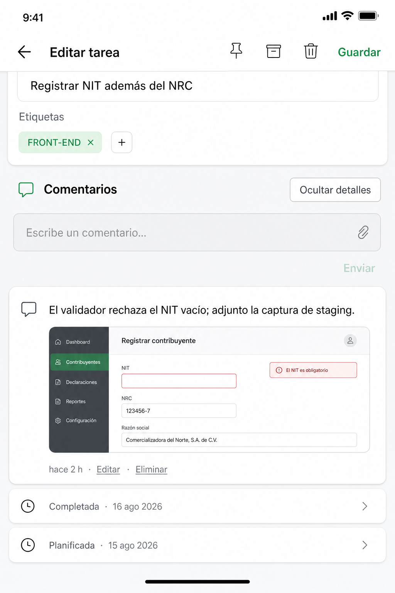
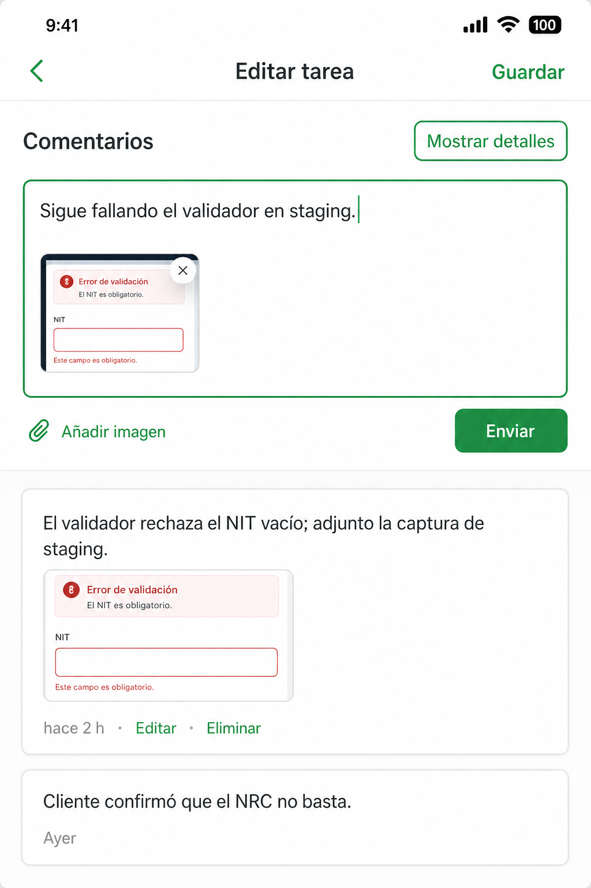
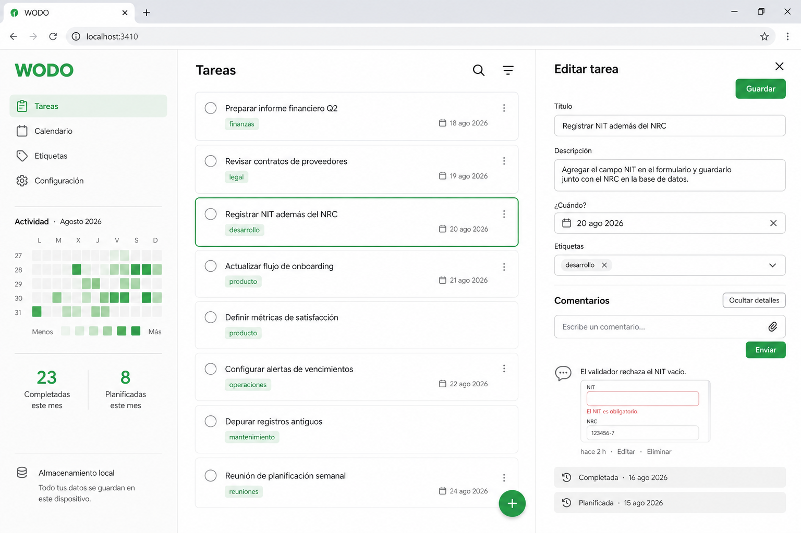
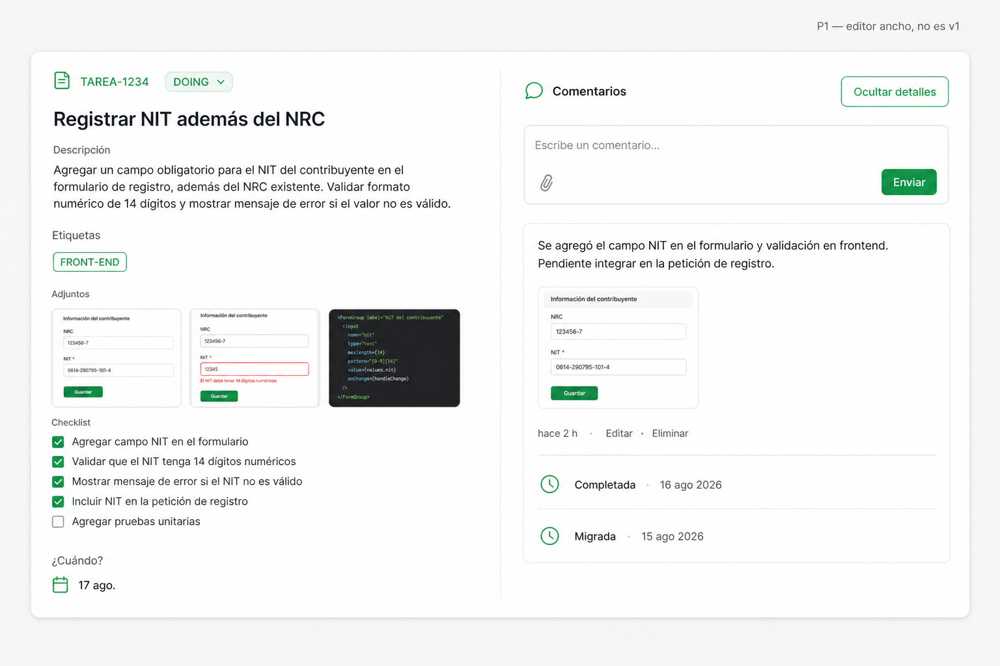

# PRD — Comentarios y actividad en el detalle

**Producto:** WODO (todos_app)  
**Versión:** 0.2  
**Fecha:** 19 Ago 2026  
**Estado:** Draft — decisiones de producto cerradas el 19 ago (layout A, `updatedAt` sí)  
**Plataforma:** Flutter (iOS / Android / Web)  
**Relación:** Extiende el editor (`NoteEditorScreen`), el historial BuJo (`TaskDayHistorySection` / `DayEntry`) y los adjuntos (`PRD-adjuntos-imagen.md`). **No** copia el feed colaborativo de Trello.

---

## 1. Resumen

Añadir en el detalle de una **nota o tarea** un **diario cronológico personal**: comentarios del usuario (texto y, opcionalmente, imágenes) mezclados con **registros del sistema** (historial de días + cambios de campos al guardar).

Un botón **Ocultar detalles / Mostrar detalles** esconde **todo lo que escribió el sistema** y deja solo los comentarios que ingresó la persona.

Esto **no** es un hilo de equipo. Una colaboración futura sería algo externo que podría reflejarse; el scope actual es personal. El patrón de Trello sirve como *feed + toggle*, no como producto a clonar.

---

## 2. Evaluación de la idea

### 2.1 Qué resuelve (vale la pena)

Hoy una nota o tarea tiene:

| Superficie | Rol |
|---|---|
| `title` + `body` | Definición del trabajo (se reescribe) |
| Adjuntos | Evidencia / portada del ítem |
| Checklist | Subpasos |
| `TaskDayHistorySection` | Qué días se planificó, completó, migró |

Falta un sitio para **anotar lo que pasó en el tiempo** sin ensuciar la descripción:

- «Hoy el cliente mandó el NIT por WhatsApp» + captura  
- «Probé el fix en staging, sigue fallando el validador»  
- Una foto del ticket / de la pantalla, atada a *ese momento*, no a la portada de la card

Eso encaja con el uso BuJo / ADHD de WODO: el diario del día dice *en qué día estuvo la tarea*; el comentario dice *qué ocurrió*.

### 2.2 Qué **no** debemos copiar de Trello

La referencia (card con sidebar «Comentarios y Actividad», avatares, «ha movido esta tarjeta de TO DO a DOING», rich text, «Seguir») asume:

1. **Varias personas** en un tablero con columnas.  
2. Un **changelog genérico** de cada movimiento de campo.  
3. Un **layout de dos columnas** (~60 % detalle / ~40 % feed) a pantalla completa.

WODO no tiene esas tres cosas:

| Trello | WODO hoy |
|---|---|
| Multi-usuario | Un usuario (+ sync opcional de *tu* cuenta) |
| Columnas Kanban | Listas + compromiso de día (`todayAt` / `dueAt`) |
| Activity = «movió de X a Y» | Activity = `DayEntry` (planificado / completado / migrado / agendado) |
| Editor a pantalla completa + sidebar | Móvil: editor full-screen. Desktop ≥1200: editor en panel derecho de **340 dp** |
| Rich text + paperclip + «Seguir» | Texto plano; adjuntos ya viven en otra sección; no hay watchers |

`PRD-adjuntos-imagen.md` §3 ya marcó «comentarios, avatares, watchers» como **no-objetivo** porque no aplican a WODO local. Esta propuesta **no contradice** eso: no añade colaboración. Añade un **journal personal** sobre el ítem.

`PRD-day-review.md` §3 dejaba fuera un «event log genérico de cada edit». **Eso se enmienda el 19 ago:** «Ocultar detalles» oculta *todo* registro de sistema, no solo el historial de días. Hace falta un log de ediciones **al persistir** (no por tecla). Los comentarios del usuario nunca se ocultan con ese botón.

### 2.3 Riesgos

| Riesgo | Mitigación |
|---|---|
| El `body` y los comentarios se solapan | Copy y UX: descripción = «qué es»; comentario = «qué pasó / nota de avance». Sin migrar el body a comentarios. |
| Imágenes de comentario vs Adjuntos | Siguen viviendo en el comentario (`commentId`). **Sí pueden ser portada** (acción explícita). No entran solas a la fila Adjuntos ni auto-portada. |
| Panel desktop de 340 dp no cabe un split Trello | v1: **misma columna** que el móvil (feed al final del editor). Split 60/40 = P1 solo si el editor deja de vivir en 340 dp. |
| Composer independiente vs «Guardar» del editor | Comentarios se persisten **al enviar**, no al Guardar del editor. En nota/tarea nueva, el composer espera a que el ítem exista (o dispara un autosave mínimo). |
| Sync | v1 **sí** sincroniza comentarios (texto + ids). Los blobs de imagen **aún no** están en el snapshot. En el otro dispositivo: texto sí, foto con placeholder hasta el slice de attachments. Si esa foto es portada, la card remota verá el id y un hueco. |
| Inflar el editor | Sección colapsable en espíritu (toggle de detalles). Sin toolbar rich. Sin «Seguir». |

### 2.4 Veredicto

**Sí: diario personal de la nota o tarea, no chat de tarjeta.**

«Ocultar detalles» = ocultar **todo registro de sistema** (días + ediciones al guardar). Lo que la persona escribe en Comentarios se queda.

Comentarios con o sin imagen: mismo pipeline de adjuntos. Una foto de comentario **puede** marcarse como portada, a mano.

---

## 3. Problema

1. La descripción se usa a la vez como spec y como bitácora → queda un párrafo eterno o se pierde el contexto.  
2. El historial de días es útil para replay, pero ruidoso cuando solo quieres leer notas de avance.  
3. Una captura del comentario a veces **sí** quiere ser portada de la card; hoy no hay camino.  
4. En desktop, el editor vive en un panel de 340 dp: el feed al final scrollea mucho (ver §16).

---

## 4. Objetivos

### Producto
- Dejar un comentario de texto en ≤ 2 toques desde el editor de una **nota o tarea** ya guardada.  
- Adjuntar 0–N imágenes a *ese* comentario (mismo flujo galería/cámara que Adjuntos).  
- Marcar una de esas imágenes como **portada** (acción explícita; no automática).  
- Ver un feed cronológico: comentarios + registros de sistema (días + ediciones).  
- **Ocultar detalles** deja solo comentarios; **Mostrar detalles** vuelve a mezclar el sistema.  
- Preferencia del toggle persistida (Settings / Hive), no por ítem.  
- Sincronizar el **texto** del comentario entre dispositivos (v1). Imágenes: placeholder remoto.

### UX
- Lenguaje visual de WODO: superficie clara, acento verde `#2DA44E`, radios 12, sin avatares de equipo.  
- Composer compacto (texto + clip + Enviar). Sin rich text. Sin checkbox «Seguir».  
- Móvil: sección al **final** del editor, teclado no tapa el composer (padding / sticky al foco).  
- Desktop v1: **igual**, dentro del panel de 340 dp. No abrir una cuarta columna.

### No-objetivos (v1)
- @menciones, reacciones, hilos anidados, «Seguir», avatares de otras personas.  
- Colaboración multi-usuario (futuro externo; el feed no se modela como chat).  
- Rich text, markdown renderizado, GIFs, vídeo, PDF.  
- Layout Trello 60/40 / ensanchar el editor (camino B, fuera de v1).  
- Sync de **blobs** de imagen (adjuntos de ítem y fotos de comentario).  
- Autoguardado de auditoría por tecla (solo al persistir).  
- Contador 💬 en la card de Home (P1).  
- Cambiar `completed` / `pinned` / `archivedAt` / fechas solo por comentar.

---

## 5. Usuarios y jobs

Persona: la misma del PRD principal — captura personal, a menudo en el móvil, a veces en web/desktop.

| Job | Resultado |
|---|---|
| Dejar rastro de un avance | Comentario visible en el detalle, con hora relativa |
| Pegar una captura al momento | Imagen bajo el texto, tap → visor ya existente |
| Revisar solo lo que yo escribí | Ocultar detalles; desaparece historial de días y «título actualizado», etc. |
| Entender el ciclo del ítem | Mostrar detalles; comentarios + registros de sistema |

---

## 6. Propuesta de UI

### 6.1 Principio

**Una sección, dos familias de fila, un filtro.** Comentario (persona) vs registro de sistema. No una pestaña «Actividad» aparte en v1. El mismo widget sirve para nota y tarea.

Autor: siempre el dueño local. Sin círculo con inicial de otra persona. Identidad visual: icono de comentario / punto de timeline en primary, no un fake «Bea 3.14».

### 6.2 Móvil (compact < 600)

El editor sigue siendo un `ListView` (título → cuerpo → ¿Cuándo? → tags → checklist → adjuntos → switch tipo). **Debajo**, sustituye el bloque actual «Historial de días» por:

```
Comentarios                          [Ocultar detalles]
┌─────────────────────────────────────┐
│ Escribe un comentario…          📎  │
└─────────────────────────────────────┘
                         [Enviar]  (activo si hay texto o imagen)

  ┌─ Comentario ──────────────────────┐
  │ Ayer el validador rechazó el NIT. │
  │ [miniatura]                       │
  │ hace 2 h · Editar · Eliminar      │
  └───────────────────────────────────┘

  · Completada · 16 ago 2026          ← sistema (DayEntry)
  · Título actualizado · hace 3 h     ← sistema (edición al Guardar)
  · Planificada · 15 ago 2026
```

Con **Ocultar detalles**:

```
Comentarios                          [Mostrar detalles]

  ┌─ Comentario ──────────────────────┐
  │ Ayer el validador rechazó el NIT. │
  │ hace 2 h                          │
  └───────────────────────────────────┘

  (sin filas de sistema: ni días ni ediciones)
```

- Header: icono `chat_bubble_outline` + título `Comentarios`.  
- El botón del toggle es un `TextButton` / chip outlined (mismo peso que «Ver más» del historial actual), no un CTA verde.  
- Composer: campo filled radio 12 + icono clip a la derecha. Al foco, aparece **Enviar** (primary).  
- Preview de imagen(es) entre el campo y Enviar, thumbs 64×64 como Adjuntos.  
- Filas de sistema: densas, `bodySmall`, color secondary. `DayEntry` → tap al día. Ediciones → no navegan.  
- Filas de comentario: card blanca / `AppSurface`, texto `bodyMedium`, meta relativa (`relative_time.dart`). En cada imagen: menú `Usar como portada` / `Quitar portada`.  
- Empty: «Todavía no hay comentarios. Los cambios del sistema aparecerán aquí al guardar.» Hide-details sin comentarios: «No hay comentarios. Muestra los detalles para ver el historial.»

Composer **sticky** solo mientras el campo tiene foco (evita comerse media pantalla en reposo).

### 6.3 Desktop (panel 340 dp — v1)

El editor embebido (`embedded: true`) **no cambia de sitio**. El feed va al final del mismo scroll.

Adaptaciones al ancho estrecho:

- Título `Comentarios` y el botón de toggle **en dos líneas** si no caben (no icon-only opaco).  
- Composer a ancho completo; clip + Enviar en la misma fila bajo el campo.  
- Miniaturas a 56 dp.  
- Sin segunda columna. El shell (perfil 300 + lista + contexto 340) se mantiene.

### 6.4 Desktop amplio — P1, no v1

Solo si en el futuro el editor deja el panel de 340 dp (p. ej. overlay ≥ 720 dp o el contexto se ensancha al abrir una tarea):

```
┌────────────── editor ≥ 720 ──────────────┐
│ Título / cuerpo / fechas / tags / …     │  Comentarios  [Ocultar…]
│ Adjuntos                                │  [composer]
│                                         │  feed sticky
└─────────────────────────────────────────┘
```

Hasta entonces, **no** forzar un split que recorte el formulario a ~200 dp.

### 6.5 Composer con imagen

```
┌─────────────────────────────────────┐
│ El validador sigue fallando…        │
│                                     │
│ ┌────┐                              │
│ │img │  ✕                           │
│ └────┘                              │
└─────────────────────────────────────┘
📎 Añadir imagen              [Enviar]
```

Action sheet igual que Adjuntos: `Tomar foto` / `Elegir de la galería` / Cancelar. En web, solo archivo.

Límite propuesto: **4 imágenes por comentario**, **12 comentarios con imagen por tarea** (además del tope de 12 adjuntos de ítem). Compresión idéntica (max edge 1920, JPEG ~85).

Enviar con **solo imagen** (sin texto) está permitido.

### 6.6 Acciones del comentario

- **Editar** texto (inline o sheet); las imágenes se pueden quitar / añadir en el mismo editor.  
- **Eliminar** → confirmación ligera o undo 4 s (misma pauta que adjuntos).  
- Tap imagen → `AttachmentViewerScreen` existente.

### 6.7 Card de lista

v1: **sin** chip 💬. Evita ruido junto a 📎 y fechas.  
P1: `💬 N` en meta si `commentCount > 0`.

---

## 7. Requisitos funcionales

### 7.1 Crear comentario (P0)
- Visible en **notas y tareas ya persistidas**.  
- Enviar habilitado si `trim(text).isNotEmpty` **o** hay ≥1 imagen pendiente.  
- Persistencia inmediata (Hive), independiente de Guardar del editor.  
- **Sí** actualiza `NoteItem.updatedAt` (es un cambio). No toca `body`, `completed`, `pinned`, `archivedAt` ni fechas.  
- Efecto en Home: una **nota** puede entrar en **Del día** hoy y subir en listas por `updatedAt`. Las **tareas** siguen entrando a Del día por fechas / log de días, no solo por este timestamp.  
- Heatmap de escritura: **sí** cuenta (usa `updatedAt`). La racha sigue siendo solo completar tareas.

### 7.2 Imágenes (P0)
- 0–N por comentario, tope §6.5.  
- **Pueden** ser portada: acción `Usar como portada` en la miniatura o el visor.  
- Primera imagen de comentario **no** auto-asigna portada (sigue valiendo solo la primera de Adjuntos del ítem).  
- No aparecen en la fila Adjuntos ni en el `📎 N` de la card, salvo que sean la portada (la card muestra la foto; el chip 📎 no las cuenta).  
- Borrar comentario: borra blobs; si una era portada → `coverAttachmentId = null`.  
- Borrar / duplicar ítem: cascade; duplicar **no** copia comentarios (bitácora del original).

### 7.3 Feed (P0)
- Orden: `createdAt` desc (más reciente arriba, debajo del composer).  
- Tipos: `comment` (persona) | `dayEntry` | `audit` (ediciones al persistir).  
- Hide-details: omite `dayEntry` **y** `audit`. Deja solo `comment`.  
- Notas: no hay (o hay pocos) `DayEntry`; el sistema son sobre todo auditorías de Guardar.

### 7.4 Toggle (P0)
- Default: **mostrar detalles**.  
- Persistido en `SettingsRepository` (`hideCommentAuditDetails: bool`).  
- Copy: `Ocultar detalles` / `Mostrar detalles`. Semantics: «Ocultar registros del sistema».

### 7.5 Ítem nuevo (P0)
- Composer deshabilitado: `Guarda la nota para comentar` / `Guarda la tarea para comentar`.

### 7.6 Backup (P0)
- Export/import incluye `comments`, `noteAudits` + bytes (maps de attachments con `commentId`).  
- Wipe borra esos boxes.

### 7.7 Sync (P0 — texto; blobs fuera)
- Entidad `comment` en snapshot y DTO backend (`note` \| `tag` \| `dayEntry` \| `comment` \| `noteAudit`).  
- Payload: texto + timestamps + ids de imagen. **Sin** `bytesBase64`.  
- Entidad `noteAudit` para que el otro dispositivo vea el mismo historial de sistema.  
- Imagen ausente: placeholder `Imagen no sincronizada` (comentario y portada).  
- Last-write-wins por `id`, igual que tags / dayEntry.

### 7.8 Auditoría de sistema (P0)
- Se escribe **al persistir** el ítem (Guardar, completar, archivar, cambiar portada…), no en cada tecla.  
- Un Guardar con varios campos tocados = **un evento por campo** que cambió (título, cuerpo, tags, fechas, tipo, checklist, portada).  
- Crear comentario / editar comentario / borrar comentario **no** generan fila de sistema.

---

## 8. Requisitos no funcionales

| Área | Requisito |
|---|---|
| Performance | 100 comentarios + historial de una tarea scrollean sin jank; thumbs cacheadas |
| Teclado | En compact, el composer visible sobre el IME |
| Accesibilidad | Hit ≥ 44; labels «Añadir imagen al comentario», «Enviar comentario», «Ocultar registros del sistema» |
| i18n | Copy ES en §12; no hardcoded en widgets nuevos más allá de la pauta actual |
| Privacidad | Local; imágenes no salen del dispositivo salvo backup explícito / futuro sync de blobs |
| Offline | CRUD completo sin red |

---

## 9. Flujos

### F1 — Comentario de texto
Abrir nota o tarea existente → scroll a Comentarios → escribir → Enviar. `updatedAt` se refresca: una nota puede aparecer hoy en **Del día**.

### F2 — Comentario con imagen + portada
Clip → galería/cámara → Enviar → thumb en el comentario → `Usar como portada` → la card de lista muestra esa foto. Sigue sin aparecer en la fila Adjuntos.

### F3 — Ocultar sistema
Tap **Ocultar detalles** → desaparecen días y «Título actualizado». Quedan solo comentarios. El setting se mantiene al abrir otro ítem.

### F4 — Ítem nuevo
Composer disabled → Guardar → composer se habilita (desktop embebido vía `onSaved`; móvil al reabrir).

### F5 — Otro dispositivo
Tras sync: el comentario de texto aparece. Si tenía foto, placeholder hasta exista sync de blobs.

### F6 — Exportar
Ajustes → Exportar incluye `comments`, `noteAudits` y bytes locales.

---

## 10. Alcance por fases

### v1 (este PRD)
- `NoteComment` + `NoteAuditEvent` + imágenes con `commentId`  
- Misma sección en **notas y tareas** (`NoteEditorScreen` full y embedded)  
- Toggle oculta **todo** lo de sistema  
- Composer texto ± imagen; portada explícita desde foto de comentario  
- Sync `comment` + `noteAudit` (sin blobs)  
- Backup  
- Tests de modelo, filtro, cascade, sync de texto

### v1.1
- Chip 💬 en card  
- Sync de blobs de imagen (cierra placeholder y portada remota)  
- Sticky composer más pulido en desktop

### v2
- Split 60/40 si se ensancha el editor (§16)  
- Reflejo de actividad externa / colaboración (fuera de este modelo personal)

---

## 11. Decisiones de producto

| # | Pregunta | Decisión v1 | Cerrada |
|---|---|---|---|
| 1 | ¿Chat de equipo o diario personal? | **Diario personal.** Colaboración futura = algo externo que podría reflejarse; no se modela ahora. | 19 ago |
| 2 | ¿Notas y tareas? | **Ambas.** Un solo widget. | 19 ago |
| 3 | ¿Qué oculta «Ocultar detalles»? | **Todo registro de sistema** (días + ediciones al persistir). Los comentarios de persona se quedan. | 19 ago |
| 4 | ¿Rich text? | **No** — texto plano | 17 ago |
| 5 | ¿Foto de comentario como portada? | **Sí**, acción explícita. No auto. No entra a la fila Adjuntos. | 19 ago |
| 6 | ¿Layout desktop? | **A** — feed al final del panel de 340 dp. Split = v2. | 19 ago |
| 7 | ¿«Seguir»? | **No** | 17 ago |
| 8 | ¿Persistencia vs Guardar del editor? | **Inmediata al Enviar** | 17 ago |
| 9 | ¿Comentar ítem no guardado? | **No** — hint para guardar primero | 17 ago |
| 10 | ¿Un comentario toca `updatedAt`? | **Sí.** Es un cambio. No altera completed/pin/archivo/fechas. Ver §11.1. | 19 ago |
| 11 | ¿Default del toggle? | **Mostrar detalles** | 17 ago |
| 12 | ¿Avatares? | **No** | 17 ago |
| 13 | ¿Sync de comentarios en v1? | **Sí** (texto + auditoría). Blobs no. | 19 ago |

### Abiertas (no bloquean kickoff)

| # | Pregunta | Inclinación |
|---|---|---|
| A | ¿Heatmap / racha? | Heatmap de escritura **sí** (via `updatedAt`). Racha **no** (solo completar). |
| B | ¿Editar un comentario deja huella «editado»? | **Sí**, timestamp `editedAt` discreto |
| C | ¿Límite de longitud del texto? | **4000** caracteres |
| D | ¿Orden del feed: nuevo arriba o abajo tipo chat? | **Nuevo arriba** (Trello; el composer está arriba) |

### 11.1 «Recientes», Del día y `updatedAt`

En el PRD original de Home, **Recientes** era la lista de notas no fijadas, ordenadas por `updatedAt`. Ese título **ya no está en pantalla**. El chip Todas muestra **Fijadas** + **Del día**.

| Superficie hoy | Cómo entra un ítem |
|---|---|
| **Del día** (notas) | `createdAt` o `updatedAt` caen en ese día de calendario |
| **Del día** (tareas) | Fechas / log de días (`todayAt`, `dueAt`, `DayEntry`), no solo `updatedAt` |
| Listas por «último cambio» | `updatedAt` desc (p. ej. Fijadas, búsquedas) |
| Heatmap de escritura | Días con create/edit (`updatedAt`) |
| Racha | Solo completar tarea (`completedAt`) |

Comentar **sí** actualiza `updatedAt` porque es un cambio: la nota puede aparecer en Del día hoy y subir en esas listas; el heatmap puede marcar el día. **No** cambia completed, pin, archivo ni fechas. **No** suma racha.

---

## 12. Copy (ES)

| Contexto | Texto |
|---|---|
| Título sección | `Comentarios` |
| Toggle on | `Ocultar detalles` |
| Toggle off | `Mostrar detalles` |
| Semantics toggle | `Ocultar registros del sistema` / `Mostrar registros del sistema` |
| Hint composer | `Escribe un comentario…` |
| Enviar | `Enviar` |
| Clip | `Añadir imagen` |
| Disabled nueva | `Guarda la nota para comentar` / `Guarda la tarea para comentar` |
| Empty mixto | `Todavía no hay comentarios. Los cambios del sistema aparecerán al guardar.` |
| Empty solo comentarios | `No hay comentarios.` |
| Empty hide + sin comentarios | `No hay comentarios. Muestra los detalles para ver el historial.` |
| Editar / Eliminar | `Editar` / `Eliminar` |
| Confirm delete | `¿Eliminar este comentario?` |
| Editado | `editado` |
| Límite | `Máximo 4 imágenes por comentario` |
| Portada | `Usar como portada` / `Quitar portada` |
| Imagen remota | `Imagen no sincronizada` |
| Audit título | `Título actualizado` |
| Audit cuerpo | `Descripción actualizada` |
| Audit tags | `Etiquetas actualizadas` |
| Audit due | `Vencimiento actualizado` |
| Audit done | `Marcada como completada` / `Reabierta` |
| Audit tipo | `Convertida en tarea` / `Convertida en nota` |

No usar «Actividad» en el título: en WODO eso es el heatmap del perfil. El toggle habla de **detalles** = registros del sistema.

---

## 13. Dependencias

- `NoteEditorScreen` / `TaskDayHistorySection` (feed unificado; historial de días pasa a ser una fila de sistema)  
- `AttachmentsRepository` + visor + action sheet  
- `DayEntriesRepository` + nuevo `NoteAuditEventsRepository`  
- `SettingsRepository`  
- Backup (`data_backup.dart`)  
- Sync: entidades `comment` y `noteAudit`; DTO Nest  
- `relative_time.dart`, `AppColors`, `ThemeTokens`

---

## 14. Consultas — cierre 19 ago

| # | Respuesta |
|---|---|
| 1 | Diario **personal**. Colaboración = futuro externo, no se diseña ahora. |
| 2 | Ocultar **todo** lo de sistema (días + ediciones). Lo escrito en Comentarios se queda. |
| 3 | **Notas y tareas**, mismo comportamiento. |
| 4 | **Sí** tocar `updatedAt` (es un cambio). «Recientes» ya no existe como título; el efecto visible es Del día / orden. Ver §11.1. |
| 5 | La foto de comentario **sí puede ser portada** (explícito). |
| 6 | **A** — feed en el panel de 340 dp. Ver §16. |
| 7 | **Sí** sincronizar comentarios (texto). Imágenes siguen sin blob en sync. |

---

## 15. Anexo — Propuestas visuales

Mocks de dirección (no píxel-perfect del Flutter actual). El chrome alrededor (heatmap, tabs, IDs tipo `TAREA-1234`) es atmósfera; **la sección Comentarios es lo que se propone**.

Archivos en `docs/comentarios/`.

### 15.1 Móvil — feed mixto (v1)

Composer arriba, comentario con imagen, debajo las filas de historial de días. El botón **Ocultar detalles** no es un CTA verde.



### 15.2 Móvil — detalles ocultos + comentario con imagen (v1)

Toggle pasa a **Mostrar detalles**. El historial desaparece. Composer con thumb y **Enviar** activo.



### 15.3 Desktop v1 — mismo feed en el panel de 340 dp

El editor **no** gana una columna extra. Comentarios al final del scroll del panel derecho.



### 15.4 Desktop P1 — split solo si el editor es más ancho

Layout de referencia tipo Trello **adaptado** (definición a la izquierda, diario a la derecha). **Fuera de v1.** Ignorar badge `DOING` / `TAREA-1234` del mock: WODO no tiene columnas Kanban.



---

## 16. Layout desktop — cerrado: camino A

En **móvil** el editor es pantalla completa: comentarios al final del scroll.

En **desktop ancho** (≥ 1200 px) el shell sigue igual:

```
┌─ ~300 dp ─┬──────── lista ────────┬─ 340 dp fijos ─┐
│  Perfil   │  Fijadas / Del día    │  Editor        │
│  heatmap  │  cards                │  … formulario  │
│           │                       │  comentarios ← │
└───────────┴───────────────────────┴────────────────┘
```

**v1 = A:** el feed vive al final de esos 340 dp (`AdaptiveBreakpoints.contextPanelWidth`). Más scroll. Cero rediseño de `DesktopContextPanel`.

**B (v2):** ensanchar el editor (≥ 720 dp) y poner el diario al lado (mock §15.4). Fuera de este slice.

---

**Owner:** Product / Design / Engineering  
**Próximo paso:** Implementar `TRD-comentarios.md` (storage → audit + feed → composer → portada → backup → sync texto).
