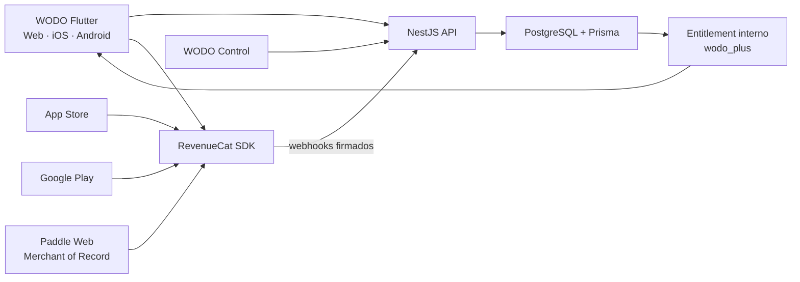
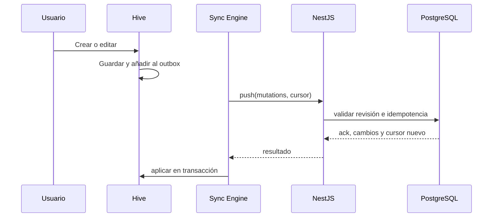

# PRD final — Plataforma WODO: cuentas, sincronización, pagos multiplataforma y cupones

**Producto:** WODO

**Versión:** 1.0

**Fecha:** 21 Jul 2026

**Estado:** Propuesta final para planificación

**Plataformas:** Flutter Web, Android e iOS
**Idiomas iniciales:** Español; arquitectura preparada para inglés

Este documento consolida y reemplaza, para esta iniciativa, el borrador
`PRD-cuentas-sync-monetizacion.md`.

---

## 1. Resumen ejecutivo

WODO es actualmente una aplicación local-first de notas y tareas. Funciona sin
cuenta y guarda la información en Hive dentro del dispositivo. La Web está
publicada en `https://app.wodo.app`; Android e iOS son los siguientes canales.

Esta fase mayor convierte WODO en un producto multiplataforma sostenible sin
abandonar su ventaja principal: capturar y consultar información aun sin conexión.

La plataforma incorporará:

1. cuentas WODO;
2. sincronización entre Web, Android e iOS;
3. suscripción WODO Plus;
4. compras en App Store, Google Play y Web;
5. un entitlement único reconocido en todos los dispositivos;
6. campañas y cupones coordinados entre proveedores;
7. una consola interna para pagos, soporte y operación;
8. telemetría sin recolectar contenido de notas;
9. una base preparada para colaboración, adjuntos, OCR e IA futura.

### Decisión recomendada

- **Backend propio:** NestJS + Prisma + PostgreSQL.
- **Cliente local-first:** Hive sigue siendo el almacenamiento local y mantiene
  una cola de operaciones pendientes.
- **Pagos:** RevenueCat normaliza App Store, Google Play y Web.
- **Checkout Web:** Paddle Billing conectado a RevenueCat; Paddle actúa como
  Merchant of Record.
- **Autorización:** entitlement interno en PostgreSQL, actualizado mediante
  webhooks verificados de RevenueCat.
- **Telemetría:** PostHog; los eventos operativos críticos también quedan en
  PostgreSQL.
- **OCR futuro:** fuera del alcance de esta fase. La primera exploración será BYOK
  (*Bring Your Own Key*): cada usuario proporciona su propia API key. Solo después
  de validar proveedores, costos y demanda se diseñará una oferta comercial WODO.

RevenueCat no reemplaza el backend WODO. Normaliza compras y suscripciones. NestJS
controla usuarios, sincronización, permisos, campañas y auditoría.

---

## 2. Contexto y estado actual

### 2.1 Capacidades existentes

- notas y tareas locales;
- etiquetas, fijadas, archivadas, búsqueda y filtros;
- fechas, recordatorios y actividad;
- importación/exportación JSON;
- temas y personalización;
- interfaz adaptativa;
- operación sin cuenta ni servidor;
- persistencia mediante Hive.

### 2.2 Limitaciones

- los datos quedan ligados a un dispositivo o navegador;
- no existe recuperación automática;
- no se puede usar una cuenta en varios dispositivos;
- no existen métricas confiables de usuarios o retención;
- no hay facturación ni entitlement premium;
- no existe consola de soporte y operación;
- futuras funciones de costo variable necesitarán cuotas y control comercial.

### 2.3 Propuesta de valor

> Tus notas y tareas, protegidas y actualizadas en todos tus dispositivos. Convierte
> también tus apuntes en papel en contenido editable de WODO.

---

## 3. Problema

### Para el usuario

- Puede perder información al cambiar o borrar un dispositivo.
- El respaldo manual queda desactualizado.
- Transcribir una nota escrita en papel es lento.
- Una compra debe reconocerse sin importar dónde se realizó.

### Para el negocio

- No se conocen adquisición, activación, retención ni conversión reales.
- Tres plataformas implican tres ciclos de facturación.
- Los cupones tienen reglas diferentes en Apple, Google y Web.
- No existe un panel único para soporte o conciliación.
- funciones futuras de consumo variable pueden generar costos inesperados.

---

## 4. Objetivos

### Producto

- Cuenta única en Web, Android e iOS.
- Sincronización offline-first sin pérdida silenciosa.
- WODO Plus reconocido en cualquier plataforma.
- Suscripción mensual/anual con precio regional.
- Campañas de adquisición, retención y retorno medibles.
- Dejar contratos y extensiones preparados para evaluar OCR en una fase futura.
- Versión gratuita útil y privada.

### Negocio

- MRR/ARR capaces de pagar infraestructura y soporte.
- Margen bruto objetivo de al menos 70% sobre costo variable.
- Evidencia verificable de uso, estabilidad y crecimiento.
- Modelo interno normalizado para reducir dependencia de proveedores.

### Técnico

- NestJS, Prisma y PostgreSQL como núcleo.
- Dominios de producto, sync, billing y analítica separados.
- Webhooks idempotentes y auditables.
- Secretos y validaciones exclusivamente server-side.
- Cuotas, límites y alertas de presupuesto.

---

## 5. No objetivos

- Colaboración simultánea entre personas.
- Espacios compartidos.
- Cifrado de extremo a extremo en esta fase.
- OCR, procesamiento de imágenes o caligrafía dentro de esta fase.
- Interpretación médica, legal o financiera.
- Resumen/traducción con IA generativa.
- Almacenamiento ilimitado de fotos originales.
- Construir validadores propios de recibos Apple/Google.
- Un código técnico idéntico en todas las tiendas: la campaña será unificada, pero
  cada plataforma conservará su mecanismo oficial.

---

## 6. Usuarios

### Usuario local

Quiere escribir inmediatamente sin registrarse ni subir información.

### Usuario multidispositivo

Usa computadora y teléfono y espera continuidad sin exportar archivos.

### Usuario de notas manuscritas (contexto futuro)

Quiere convertir una foto del cuaderno, pizarra o reunión en texto editable.

### Operaciones/soporte

Necesita saber por qué una cuenta no tiene Plus, de dónde provino el pago, qué
cupón se usó y qué webhook falló, sin leer las notas.

### Producto

Necesita medir usuarios activos, plataformas, retención, conversión y churn.

---

## 7. Modelo comercial

### 7.1 Planes

| Capacidad | WODO Gratis | WODO Plus |
|---|---:|---:|
| Notas y tareas locales | Ilimitadas | Ilimitadas |
| Etiquetas, filtros, archivo y actividad | Sí | Sí |
| Temas, fondos y recordatorios locales | Sí | Sí |
| Importar/exportar manualmente | Sí | Sí |
| Uso sin conexión | Sí | Sí |
| Cuenta | Opcional | Requerida |
| Sincronización Web/Android/iOS | No | Sí |
| Respaldo automático | No | Sí |
| Historial recuperable | No | 30 días |
| Dispositivos activos | 1 local | Hasta 5 |
| Soporte | Email/comunidad | Prioridad razonable |

### 7.2 Precio propuesto

- **Mensual:** USD 4.99.
- **Anual:** USD 39.99.
- **Trial:** 14 días para usuarios elegibles.
- **Founding Annual:** USD 29.99 el primer año, campaña limitada.
- Precios regionales en Apple, Google y Paddle.

Son hipótesis sujetas a validación. El anual será recomendado visualmente, mostrando
el precio total, la renovación y la cancelación claramente.

### 7.3 Funciones de consumo variable

OCR no forma parte de WODO Gratis ni WODO Plus en este lanzamiento. Se documenta
como contexto futuro en la sección 13. No se crean todavía cuotas, créditos,
productos consumibles ni promesas comerciales relacionadas con OCR.

---

## 8. Pagos multiplataforma

### 8.1 Arquitectura



### 8.2 Responsabilidades

| Componente | Responsabilidad |
|---|---|
| App Store | Cobro, renovación, reembolso y ofertas iOS |
| Google Play | Cobro, renovación, reembolso y ofertas Android |
| Paddle | Checkout, impuestos, fraude, facturas y portal Web |
| RevenueCat | Validación, normalización y entitlement multiplataforma |
| NestJS | Identidad, autorización, webhooks, sync y reglas |
| PostgreSQL | Estado interno, auditoría y campañas |
| WODO Control | Operación y soporte unificados |

RevenueCat soporta Flutter Web con RevenueCat Billing, Stripe o Paddle. Las compras
Web y nativas se configuran por separado, pero comparten entitlements usando el
mismo `appUserID`. Fuentes:
[RevenueCat Flutter](https://www.revenuecat.com/docs/getting-started/installation/flutter)
y [RevenueCat Web](https://www.revenuecat.com/docs/web/overview).

### 8.3 Identidad de pago

- `appUserID` = UUID interno WODO, nunca email.
- Crear/vincular cuenta antes de comprar.
- Mismo UUID en todos los dispositivos.
- Logout limpia identidad del SDK.
- Reconocimiento cross-platform objetivo: menos de 60 segundos p95.

### 8.4 Catálogo

| Concepto | Apple | Google | Paddle Web |
|---|---|---|---|
| Plus mensual | `wodo_plus_monthly` | `wodo_plus` / `monthly` | price mensual |
| Plus anual | `wodo_plus_annual` | `wodo_plus` / `annual` | price anual |

Entitlement único: `wodo_plus`. Los IDs definitivos viven en `ProductMapping`, no
dispersos por el código Flutter.

### 8.5 Estados

- `trialing`;
- `active`;
- `grace_period`;
- `billing_issue`;
- `paused`;
- `canceled_pending_expiration`;
- `expired`;
- `revoked`;
- `unknown_review_required`.

Reglas:

- cancelar conserva acceso hasta `currentPeriodEnd`;
- fallos temporales respetan gracia del proveedor;
- reembolso/revocación puede retirar acceso inmediatamente;
- eventos antiguos no sobrescriben un estado más reciente;
- Flutter nunca concede Plus por sí solo;
- un job diario reconcilia suscripciones activas.

### 8.6 Administrar suscripción

- iOS abre App Store;
- Android abre Google Play Subscription Center;
- Web abre portal Paddle;
- se muestra el origen de compra;
- no se migra automáticamente una suscripción activa entre tiendas.

### 8.7 Costos conocidos

- RevenueCat: gratis hasta USD 2,500 MTR; luego 1% de MTR.
  [RevenueCat Pricing](https://www.revenuecat.com/pricing).
- Paddle: 5% + USD 0.50 por transacción pay-as-you-go, con MoR e impuestos.
  [Paddle Pricing](https://www.paddle.com/pricing).
- Comisiones Apple/Google dependen de programa y región y se revisan antes de cada
  lanzamiento.

### 8.8 Proveedores evaluados

| Opción | Ventaja | Desventaja | Decisión |
|---|---|---|---|
| RevenueCat + Paddle | Integración Flutter/Web y entitlement unificado | Gratis hasta USD 2.5K MTR | Elegida |
| Adapty + Paddle | Paywalls/growth y gratis hasta USD 5K MTR | Cambio futuro si ya se integra RC | Alternativa A |
| Qonversion + Paddle | Gratis hasta USD 10K MTR | Revisar funciones por plan | Alternativa B |
| NestJS directo + Paddle | Máximo control | Mantener lifecycle Apple/Google | No P0 |
| RevenueCat + Polar | Buen MoR/cupones Web | Dos fuentes de entitlement | No P0 |

Fuentes: [Adapty Pricing](https://adapty.io/pricing/) y
[Qonversion Pricing](https://qonversion.io/pricing).

Polar sigue siendo buena alternativa Web por su MoR y descuentos, pero Paddle tiene
integración formal como billing engine de RevenueCat. No integrar ambos en P0.

---

## 9. Cupones, ofertas y campañas

### 9.1 Campaña unificada

No existe un cupón técnico universal. WODO Control manejará una campaña que mapea
los mecanismos oficiales:

```text
campaignKey: FOUNDERS_2026
appleOfferCodeRef: founders-2026
googleOfferId: founders-2026
paddleDiscountId: dsc_...
startsAt / endsAt / maxRedemptions / audience
```

### 9.2 Apple

- Offer Codes únicos o personalizados.
- Elegibilidad para usuarios nuevos, activos o expirados.
- Hasta 1 millón de canjes por app/trimestre.
- Canje por URL, App Store o dentro de la app.

Fuente: [Apple Offer Codes](https://developer.apple.com/help/app-store-connect/manage-subscriptions/set-up-subscription-offer-codes/).

### 9.3 Google Play

- Base plans y offers con trial o descuento.
- Elegibilidad de adquisición, upgrade o determinada por WODO.
- Promo codes únicos y personalizados con reglas propias.

Fuentes: [Google Play Offers](https://support.google.com/googleplay/android-developer/answer/140504)
y [Google Play Promotions](https://support.google.com/googleplay/android-developer/answer/6321495).

### 9.4 Paddle Web

- Descuentos gestionados en Paddle.
- RevenueCat refleja compra/entitlement; Paddle administra descuento, impuestos y
  portal.

### 9.5 Requisitos

WODO Control debe:

- crear campaña interna y objetivo;
- asociar referencias Apple/Google/Paddle;
- definir audiencia, fechas, región, producto y límites;
- mostrar configuración pendiente por proveedor;
- medir vistas, canjes, trials, pagos, renovación y churn;
- evitar campañas incompatibles;
- exportar CSV;
- auditar cada cambio.

Campañas iniciales:

- `FOUNDERS_2026`;
- `TRIAL_14D`;
- `ANNUAL_UPGRADE` P1;
- `WINBACK_50` P1;
- `SUPPORT_GRANT` interno.

---

## 10. Plataforma interna WODO Control

### 10.1 Objetivo

Centralizar soporte, pagos, entitlements, campañas, telemetría y auditoría sin
reemplazar las consolas financieras oficiales.

### 10.2 Arquitectura

- aplicación Web privada;
- recomendado Next.js/React por tablas y ecosistema admin;
- consume solo endpoints admin de NestJS;
- MFA obligatorio;
- roles `support`, `finance`, `product`, `admin`;
- toda mutación crea `AdminAuditLog`;
- dominio privado y allowlist/VPN cuando sea viable.

### 10.3 Módulos

**Resumen:** MRR/ARR, trials, cancelaciones, billing issues, distribución por
tienda, ingreso neto estimado y salud de sync.

**Usuarios:** UUID/email, última actividad, dispositivos, plan, proveedor, periodo,
sesiones y actividad técnica. Nunca títulos, cuerpos o imágenes privadas.

**Billing:** suscripciones, eventos, idempotencia, enlaces externos, reconciliación,
retry y grants temporales auditados.

**Campañas:** catálogo, referencias externas, cohortes y exportación.

**Operación:** salud API/DB/colas, backups, conciliaciones y versiones Flutter.

### 10.4 Límites

- No procesa tarjetas.
- No reemplaza tiendas/Paddle para reembolsos.
- No modifica recibos externos.
- No permite leer notas.
- No concede acceso permanente sin auditoría.

---

## 11. Cuentas e identidad

### 11.1 Métodos

- email y contraseña;
- recuperación de contraseña;
- Google;
- Sign in with Apple;
- magic link P1 si deep links funcionan confiablemente.

### 11.2 Sesiones

- access token corto;
- refresh token rotativo y hasheado;
- en Android/iOS, access y refresh token se guardan exclusivamente en el
  Keystore/Keychain mediante almacenamiento seguro del sistema, nunca en Hive;
- migración automática de instalaciones existentes: copiar a almacenamiento
  seguro y eliminar las claves antiguas solo después de completar la escritura;
- en Web, exigir HTTPS; mantener como objetivo P1 mover el refresh token a cookie
  `HttpOnly`, `Secure` y `SameSite` emitida por NestJS;
- sesión independiente por dispositivo;
- cierre individual/global;
- detección de reutilización;
- máximo cinco dispositivos Plus;
- email verificado antes de sincronizar.

### 11.3 Cuenta y plan

- Crear cuenta no obliga a pagar.
- Una cuenta gratuita no activa sync completo.
- Activar Plus inicia migración local-cloud.
- Identidad/telemetría no dan acceso al contenido.

### 11.4 Eliminación

- disponible en app y Web;
- eliminar cuenta no cancela automáticamente la suscripción externa;
- guiar primero al portal correspondiente;
- revocar sesiones;
- borrar contenido/metadatos según retención;
- conservar solo registros financieros legalmente necesarios;
- confirmar por email.

---

## 12. Sincronización local-first

### 12.1 Principios

- Toda edición se guarda primero en Hive.
- La red no bloquea crear, editar, completar o buscar.
- Un `outbox` registra mutaciones pendientes.
- NestJS recibe lotes idempotentes.
- PostgreSQL es fuente cloud para Plus.
- Cada dispositivo mantiene cursor de cambios.
- No hay colaboración en tiempo real.

### 12.2 Flujo



### 12.3 Datos P0

- notas/tareas;
- tags;
- archivo y fijado;
- fechas y estado de tareas;
- day entries;
- preferencias funcionales esenciales.

Preferencias puramente visuales pueden quedar por dispositivo.

### 12.4 Metadatos

- `id` UUID generado por cliente;
- `userId`;
- `revision` del servidor;
- `clientMutationId`;
- `originDeviceId`;
- `createdAt`;
- `updatedAt` de cliente informativo;
- `serverUpdatedAt`;
- `deletedAt`;
- `schemaVersion`.

### 12.5 Conflictos

- Fusionar campos independientes cuando sea seguro.
- Nunca descartar silenciosamente edición concurrente del cuerpo.
- Si dos dispositivos modifican texto desde la misma revisión, aceptar una versión
  y crear `conflictCopy` de la otra.
- Mostrar “Revisar conflicto”.
- Operaciones de tarea usan la mayor revisión confirmada y conservan actividad.

### 12.6 Eliminaciones

- Tombstones sincronizados.
- Retención mínima 90 días.
- Historial Plus recupera durante 30 días.
- Purga definitiva mediante job auditable.

### 12.7 Migración inicial

1. Crear respaldo JSON local.
2. Consultar datos cloud.
3. Presentar conteos sin loggear contenido.
4. Ofrecer “Combinar” por defecto.
5. Subir lote con IDs existentes.
6. Resolver por ID/revisión.
7. Confirmar integridad.
8. Conservar respaldo siete días o hasta confirmación.

### 12.8 Expiración Plus

- Mantener datos descargados en Hive.
- Detener sync tras gracia.
- Permitir uso local y exportación.
- Mantener cloud 90 días.
- Al reactivar, reconciliar cambios.
- Avisar antes de purga cuando corresponda.

---

## 13. Contexto futuro — OCR manuscrito e impreso

OCR queda explícitamente fuera del alcance de la fase mayor descrita por este PRD.
No forma parte de WODO Plus, no tiene fecha comprometida y no se crearán todavía
productos, cuotas, créditos, endpoints, workers ni almacenamiento de imágenes.

### 13.1 Caso de uso futuro

Fotografiar una hoja, cuaderno, pizarra o documento y obtener un borrador editable
que el usuario revisa antes de guardar como nota o tarea.

### 13.2 Primera exploración: BYOK

La primera versión experimental, si se autoriza en un PRD posterior, utilizará
BYOK (*Bring Your Own Key*):

- el usuario elige entre proveedores compatibles;
- introduce una API key creada en su propia cuenta del proveedor;
- WODO no paga ni revende ese consumo;
- el proveedor factura directamente al usuario;
- WODO muestra instrucciones, conectividad y estado de validación;
- no se promete disponibilidad, cuota o soporte del proveedor externo;
- el resultado siempre es editable antes de guardarse.

La key no se almacenará en PostgreSQL ni aparecerá en WODO Control, telemetría o
logs. En móvil se evaluará almacenamiento seguro del sistema. En Web se deberá
resolver el riesgo de exposición y compatibilidad CORS antes de habilitar BYOK;
si no existe una solución segura, OCR BYOK no se ofrecerá en Web.

Si un proveedor requiere que NestJS actúe como proxy, la key del usuario podrá
usarse solo en memoria durante la solicitud y nunca persistirse. Esta posibilidad
requiere threat model, redacción de errores y autorización explícita adicional.

### 13.3 Opciones técnicas a evaluar

- ML Kit Text Recognition para OCR local en Android/iOS;
- Apple Vision en iOS;
- Google Cloud Vision para documentos/manuscritos;
- otros proveedores con soporte real de español manuscrito;
- procesamiento local para reducir costo y exposición de imágenes.

Fuentes de contexto:
[ML Kit Text Recognition](https://developers.google.com/ml-kit/vision/text-recognition/v2),
[Cloud Vision Handwriting](https://docs.cloud.google.com/vision/docs/handwriting) y
[Apple Vision](https://developer.apple.com/documentation/vision/vnrecognizetextrequest).

### 13.4 Evaluación comercial posterior

Antes de que WODO pague o revenda OCR se realizará una investigación específica:

- precisión con muestras manuscritas reales en español;
- precio por página y costo total incluyendo storage/egress;
- términos que permitan integración comercial o reventa;
- tratamiento de datos, retención, regiones y DPA;
- SLA, rate limits, soporte y estabilidad;
- margen esperado por usuario y riesgo de abuso;
- aceptación de precio y frecuencia real de uso.

Las opciones comerciales futuras, sin decisión tomada, podrán ser:

1. cuota OCR incluida en WODO Plus;
2. add-on mensual separado;
3. paquetes de créditos consumibles;
4. un nivel superior de suscripción;
5. OCR local incluido y cloud como consumo adicional.

La alternativa solo avanzará si mantiene margen bruto objetivo de al menos 70% y
si las reglas de App Store, Google Play y Web permiten venderla coherentemente.

### 13.5 Referencia del modelo de cobro considerado originalmente

Como hipótesis comercial de referencia —no aprobada ni incluida en las Releases
0–3— se había considerado un modelo híbrido:

- **WODO Plus incluiría 60 páginas OCR cloud por periodo mensual.** La cuota se
  renovaría cada mes aunque la suscripción se hubiera contratado de forma anual.
- **Una página procesada consumiría un crédito.** Reintentos técnicos fallidos no
  deberían descontar créditos; un nuevo procesamiento solicitado por el usuario sí.
- **Al agotar la cuota, podrían comprarse paquetes de 100 créditos OCR** mediante un
  pago único. Los créditos adicionales no formarían otra suscripción.
- En **iOS y Android**, el paquete se vendería como compra consumible mediante App
  Store In-App Purchase y Google Play Billing, respectivamente.
- En **Web**, el paquete se vendería como compra única mediante Paddle Checkout.
- **RevenueCat normalizaría los eventos de las tiendas**, pero NestJS mantendría el
  ledger autoritativo de créditos, idempotencia y conciliación. WODO Control mostraría
  compras, consumo agregado, ajustes auditados y discrepancias, nunca imágenes o texto.
- El producto lógico podría llamarse `wodo_ocr_credits_100`, con un identificador
  distinto por proveedor y plataforma mediante `ProductMapping`.

No se definió un precio porque primero deben medirse el costo real por página, las
comisiones, impuestos, tasa de error y demanda. El precio solo sería viable si deja
un margen bruto objetivo de al menos 70%. Este modelo queda como referencia para una
evaluación futura frente a BYOK, OCR local, add-on mensual o un nivel superior.

### 13.6 Requisitos mínimos de cualquier fase OCR

- consentimiento claro antes de enviar una imagen a terceros;
- objetos privados y eliminación temporal verificable;
- nunca enviar texto o imagen a analytics/logs/admin;
- no utilizar contenido para entrenamiento propio;
- permitir desconectar/eliminar la API key;
- mostrar proveedor y responsabilidad de costos;
- no guardar automáticamente resultados sin revisión.

---

## 14. Telemetría y evidencia de uso

### 14.1 Plataforma

PostHog es recomendado: su SDK Flutter soporta iOS, Android y Web y permite eventos
anónimos/identificados y opt-out. Fuente:
[PostHog Flutter](https://posthog.com/docs/libraries/flutter).

La aplicación usa una interfaz interna de analytics para poder reemplazar proveedor.

### 14.2 Eventos

| Evento | Propiedades permitidas |
|---|---|
| `app_opened` | plataforma, versión, locale |
| `onboarding_completed` | plataforma, duración aproximada |
| `item_created` | note/task, plataforma |
| `task_completed` | plataforma |
| `search_used` | plataforma; nunca query |
| `account_created` | método, plataforma |
| `sync_started` | trigger, plataforma |
| `sync_completed` | duración, conteos |
| `sync_failed` | categoría segura |
| `paywall_viewed` | placement, offering, plataforma |
| `purchase_started` | producto, plataforma |
| `purchase_completed` | producto, proveedor, moneda |
| `trial_started` | producto, proveedor |
| `coupon_redeemed` | campaignKey, proveedor |

### 14.3 Datos prohibidos

- títulos/cuerpos;
- búsquedas;
- nombres de tags;
- imágenes o contenido de archivos;
- nombres de archivo;
- tokens, passwords o recibos;
- IDs publicitarios;
- ubicación precisa/contactos.

### 14.4 Dashboards

- DAU/WAU/MAU y stickiness;
- activación y retención D1/D7/D30;
- plataformas/versiones;
- anónimos/registrados/Plus;
- dispositivos por usuario;
- salud sync;
- funnel paywall→checkout→trial→pago→renovación;
- MRR, ARR, churn, LTV y tienda;
- campaña/cupón;
- crashes/errores.

Conservar exportaciones/capturas fechadas de PostHog, RevenueCat, App Store Connect
y Play Console. Diferenciar instalaciones, cuentas y usuarios activos.

---

## 15. Backend y modelo de datos

### 15.1 Módulos NestJS

- `AuthModule`, `UsersModule`, `DevicesModule`;
- `SyncModule`, `NotesModule`;
- `BillingModule`, `EntitlementsModule`, `CampaignsModule`;
- `AnalyticsModule`;
- `AdminModule`, `JobsModule`, `AuditModule`.

### 15.2 Entidades

```text
User · UserIdentity · Session · Device
Note · Tag · DayEntry · SyncMutation · SyncCursor
Subscription · Entitlement · BillingEvent · ProductMapping
Campaign · CampaignProviderMapping · CouponRedemption
AdminUser · AdminAuditLog
```

### 15.3 Modelo conceptual billing

```prisma
model Subscription {
  id                     String   @id @default(uuid())
  userId                 String
  provider               BillingProvider
  store                  BillingStore
  externalCustomerId     String?
  externalSubscriptionId String
  productCode            String
  status                 SubscriptionStatus
  currentPeriodStart     DateTime?
  currentPeriodEnd       DateTime?
  cancelAtPeriodEnd      Boolean  @default(false)
  environment            BillingEnvironment
  lastProviderEventAt    DateTime?
  createdAt              DateTime @default(now())
  updatedAt              DateTime @updatedAt

  @@unique([provider, externalSubscriptionId])
  @@index([userId, status])
}

model Entitlement {
  id        String    @id @default(uuid())
  userId    String
  key       String
  active    Boolean
  source    BillingProvider
  expiresAt DateTime?
  updatedAt DateTime  @updatedAt

  @@unique([userId, key])
}

model BillingEvent {
  id              String   @id @default(uuid())
  provider        BillingProvider
  externalEventId String
  eventType       String
  eventAt         DateTime
  receivedAt      DateTime @default(now())
  processedAt     DateTime?
  status          EventProcessingStatus
  retryCount      Int      @default(0)
  payloadHash     String

  @@unique([provider, externalEventId])
}
```

El payload completo puede conservarse cifrado por tiempo corto y acceso restringido.
`payloadHash` permanece para auditoría/idempotencia.

### 15.4 Endpoints

```text
POST   /auth/register|login|refresh|logout
POST   /auth/oauth/:provider
DELETE /me

POST   /sync/push
GET    /sync/pull?cursor=...
GET    /sync/status

GET    /me/entitlements
GET    /me/subscription
GET    /me/devices
DELETE /me/devices/:id

POST   /webhooks/revenuecat
POST   /billing/reconcile/:userId       # interno

POST   /analytics/events

GET    /admin/users
GET    /admin/billing/events
POST   /admin/entitlements/grant
POST   /admin/campaigns
```

### 15.5 Jobs

- reconciliar suscripciones;
- retry de webhooks;
- purgar tombstones;
- expirar grants;
- backup/restauración;
- agregados WODO Control;
- alertas de presupuesto.

### 15.6 Organización del repositorio por carpetas

El backend se incorporará en este mismo repositorio, sin mover la aplicación
Flutter de la raíz. Esto conserva los comandos, automatizaciones y despliegue Web
actuales, y permite evolucionar a un monorepo de forma incremental.

```text
todos_app/
├── lib/                          # Aplicación Flutter
├── test/                         # Pruebas Flutter
├── android/                      # Proyecto Android
├── ios/                          # Proyecto iOS
├── web/                          # Bootstrap Web
├── pubspec.yaml
├── backend/                      # API NestJS
│   ├── src/
│   │   ├── auth/
│   │   ├── users/
│   │   ├── devices/
│   │   ├── sync/
│   │   ├── notes/
│   │   ├── billing/
│   │   ├── entitlements/
│   │   ├── campaigns/
│   │   ├── analytics/
│   │   ├── admin/
│   │   ├── jobs/
│   │   ├── audit/
│   │   ├── app.module.ts
│   │   └── main.ts
│   ├── prisma/
│   │   ├── schema.prisma
│   │   ├── migrations/
│   │   └── seed.ts
│   ├── test/
│   ├── Dockerfile
│   ├── package.json
│   ├── tsconfig.json
│   └── .env.example
├── control/                      # Panel interno WODO Control
│   ├── src/
│   ├── package.json
│   └── Dockerfile
├── packages/
│   └── api-contracts/            # OpenAPI y tipos generados
├── infrastructure/
│   ├── compose.dev.yml           # PostgreSQL + Valkey para desarrollo
│   └── scripts/
└── deploy/
    ├── backend/
    ├── control/
    └── README.md
```

Responsabilidades y límites:

- **Raíz Flutter:** producto que funciona local-first, cliente de sync, login,
  paywall y telemetría. No contiene secretos de proveedores ni reglas autoritativas
  de entitlement.
- **`backend/`:** API NestJS, Prisma, autenticación, sincronización, billing,
  entitlements, campañas, analítica operativa y auditoría. Es la autoridad para
  acceso Plus y estado sincronizado.
- **`backend/src/*/`:** cada dominio conserva controller, service, DTO, pruebas y
  adaptadores propios. Los módulos no acceden directamente a tablas de otro dominio;
  colaboran mediante servicios o contratos explícitos.
- **`control/`:** aplicación interna independiente para soporte, conciliación,
  campañas, métricas y auditoría. Se implementará después de estabilizar autenticación
  y contratos del backend; nunca tendrá una vista del contenido de notas.
- **`packages/api-contracts/`:** especificación OpenAPI y clientes/tipos generados.
  No contiene lógica de negocio ni modelos Prisma compartidos con Flutter.
- **`infrastructure/`:** composición local y scripts repetibles. Valkey se usa para
  colas, rate limiting y coordinación efímera; PostgreSQL sigue siendo la fuente de
  verdad. No se versionan secretos ni datos de producción.
- **`deploy/`:** manifiestos y documentación de producción. Debe respetar el Caddy
  compartido y limitar cambios al bloque marcado de WODO.

Convenciones operativas:

- Flutter se ejecuta desde la raíz con `flutter test`, `flutter analyze` y
  `flutter build web`.
- Backend y Control administran sus dependencias y comandos dentro de sus carpetas.
- Las migraciones Prisma se generan y ejecutan únicamente desde `backend/`.
- El contrato OpenAPI es la frontera entre Flutter, Control y NestJS; los cambios
  incompatibles requieren versionado y una ventana de migración.
- `compose.dev.yml` es solo para desarrollo local. Producción usa servicios,
  credenciales y backups gestionados por despliegue.
- OCR no crea carpetas, módulos ni infraestructura en esta fase. Cualquier futura
  implementación requiere un PRD técnico separado y una decisión BYOK/comercial.

---

## 16. Seguridad y privacidad

### Seguridad

- TLS;
- passwords Argon2id;
- refresh tokens hasheados/rotativos;
- tokens de sesión en Keychain/Keystore y nunca en Hive;
- rate limits;
- firma/timestamp de webhooks;
- idempotencia;
- secretos en secret manager;
- MFA y RBAC admin;
- backups cifrados externos;
- restauración probada;
- auditoría administrativa;
- alertas de anomalías.

### Privacidad

- política en Web/apps;
- analytics sin contenido y con opt-out aplicable;
- exportación/eliminación;
- Data Safety/App Privacy actualizadas;
- DPA/terms de proveedores;
- retenciones documentadas;
- no venta de datos.

WODO Control no tendrá interfaz para leer notas. Soporte solo recibe contenido si
el usuario decide exportarlo y enviarlo por otro canal.

---

## 17. Infraestructura y operación

### 17.1 Despliegue

En la infraestructura actual:

- `/opt/wodo/api`: NestJS;
- `/opt/wodo/control`: panel interno;
- PostgreSQL dedicado o administrado;
- Valkey para colas, rate limiting y coordinación efímera;
- backups externos diarios.

No exponer PostgreSQL ni Valkey. Registrar rutas en el bloque WODO del Caddy
compartido sin alterar otros proyectos.

### 17.2 Base de datos

VPS en beta solo con volumen, backup externo, monitoreo, restauración probada y
aislamiento. Para producción con pagos/datos personales, evaluar PostgreSQL
administrado.

### 17.3 Observabilidad

- logs estructurados/redactados;
- métricas API, DB, Valkey, cola, sync y billing;
- tracing de jobs/webhooks;
- alertas de error/latencia;
- healthchecks;
- Sentry o equivalente.

### 17.4 SLO inicial

- API: 99.5% beta, objetivo 99.9%;
- sync p95 < 3 s sin archivos;
- compra cross-platform p95 < 60 s;
- webhook p95 < 60 s;
- RPO 24 h beta/1 h producción;
- RTO 4 h beta/1 h producción.

---

## 18. Flujos principales

### F1 — Local

Abrir → Continuar sin cuenta → crear notas locales → Plus solo ante intención.

### F2 — Activar sync

Ajustes → Sincronizar → beneficios → cuenta → respaldo → paywall → compra →
migración → “Actualizado”.

### F3 — Compra cross-platform

Comprar anual Web → Paddle → RevenueCat → webhook NestJS → entitlement → iniciar
sesión iOS → descargar datos.

### F4 — Restaurar

Ajustes → Restaurar compras → RevenueCat consulta tienda → vincular UUID autorizado
→ actualizar entitlement.

### F5 — Cupón

Campaña detecta plataforma → mecanismo oficial → proveedor valida → RevenueCat
actualiza → WODO atribuye `campaignKey`.

### F6 — Cancelar

Ajustes → Administrar → portal origen → cancelar → acceso hasta vencimiento → modo
local conservando datos.

### F7 — Soporte

Buscar usuario → entitlement/tienda/eventos → reconciliar → grant temporal auditado
si corresponde; nunca cambiar recibo.

---

## 19. Requisitos no funcionales

| Área | Requisito |
|---|---|
| Offline | Crear, editar, completar y buscar sin red |
| Integridad | Ninguna vinculación borra silenciosamente |
| Rendimiento | 60fps con 500 items en equipo medio |
| Accesibilidad | Contraste AA, labels y targets adecuados |
| i18n | ES inicial, EN preparado |
| Seguridad | Secretos server-side, RBAC, auditoría |
| Privacidad | Sin contenido en analytics/logs/admin |
| Escalabilidad | Sync incremental y workers horizontales |
| Portabilidad | Catálogo/entitlement internos |
| Testabilidad | Sandboxes y fixtures de webhooks |

---

## 20. Métricas de éxito

### Uso

- ≥55% crea primer item en 24 h;
- ≥25% de activados regresa D7;
- ≥15% de cuentas activas usa 2+ dispositivos;
- ≥95% de sync termina sin error recuperable;
- conflictos visibles en <0.5% de notas.

### Monetización

- 8–15% abre paywall;
- 15–25% de trials llega a pago;
- 2–5% de activos convierte a Plus;
- ≥65% elige anual;
- churn mensual equivalente <6%;
- margen bruto ≥70%;
- cross-platform p95 <60 s.

### Operación

- 100% eventos billing idempotentes;
- <0.1% cuentas en revisión manual;
- cero mutaciones admin sin audit log;
- restore de backup mensual;
- crash-free sessions ≥99.5%.

---

## 21. Fases de implementación

La iniciativa es una fase mayor dividida en releases con gates independientes.

### Release 0 — Validación técnica y comercial (1–2 semanas)

- Spike RevenueCat Flutter Web + Paddle sandbox.
- Productos sandbox Apple/Google.
- Webhook firmado hacia NestJS.
- Mismo `appUserID` en dos plataformas.
- Comparación final RevenueCat/Adapty/Qonversion.
- Validar elegibilidad de cuenta Paddle y payouts.
- Threat model y estimación de costos.

**Gate:** compra sandbox reconocida cross-platform y arquitectura de identidad validada.

### Release 1 — Backend y cuentas (3–5 semanas)

- NestJS/Prisma/PostgreSQL.
- Auth, sesiones, dispositivos y eliminación.
- CI/CD, backups, secretos y observabilidad.
- PostHog con eventos base.
- WODO Control: MFA, resumen y usuarios.

### Release 2 — Sincronización beta (4–6 semanas)

- Outbox/cursor.
- Push/pull.
- Notas, tareas, tags y day entries.
- Migración local-cloud.
- Conflictos y tombstones.
- Estados UI.
- Pruebas Web+iOS+Android, offline y reinstalación.
- Beta gratuita temporal.

### Release 3 — Billing multiplataforma (3–5 semanas)

- RevenueCat Flutter.
- Productos App Store/Google.
- Paddle Web.
- Webhook, catálogo y entitlement interno.
- Paywall, trial, compra, restore y management.
- WODO Control billing/events/reconciliation.
- Campañas Founders y Trial.
- Revisión de políticas y rollout gradual.

### Release 4 — Estabilización y optimización continua

- Annual upgrade y win-back.
- Experimentos de paywall/precio.
- Historial 30 días.
- Precios regionales.
- Reducción de churn.
- Evaluar adjuntos, colaboración y E2EE.
- Investigar OCR BYOK y alternativas comercializables únicamente mediante un PRD
  separado, sin fecha ni alcance comprometidos en esta fase.

**Estimación global Releases 0–3:** 11–18 semanas, según equipo, infraestructura,
verificación de proveedores y revisión de tiendas. Release 4 es continua y no forma
parte de esa estimación.

---

## 22. Estrategia de pruebas

### 22.1 Billing

- mensual/anual por tienda;
- trial elegible/no elegible;
- compra pendiente;
- renovación/cancelación/grace period;
- reembolso/revocación;
- restore correcto/incorrecto;
- webhook duplicado, retrasado y fuera de orden;
- sandbox/producción;
- compra Web con acceso móvil;
- campaña/cupón por plataforma;
- conciliación tras caída.

### 22.2 Sync

- offline 24 horas;
- misma nota en dos dispositivos;
- borrar offline/editar remoto;
- reinstalar/recuperar;
- IDs duplicados;
- datos local+cloud;
- expirar/reactivar Plus;
- lotes parciales/retry;
- cambio de schema.

### 22.3 Seguridad

- acceso cruzado;
- manipulación de `appUserID`;
- firma webhook inválida/replay;
- reuse de refresh token;
- escalación admin;
- rate limits;
- restore backup;
- dependency/secret scanning.

---

## 23. Riesgos y mitigaciones

| Riesgo | Impacto | Mitigación |
|---|---|---|
| Pérdida al vincular | Crítico | Backup, merge y conflictos preservados |
| Entitlement incorrecto | Alto | RC + estado interno + idempotencia + conciliación |
| Rechazo de tienda | Alto | IAP nativo, términos claros, revisión regional |
| Cupones inconsistentes | Medio | Campaign mapping por proveedor |
| Caída VPS | Alto | Backups externos, monitoreo, DB administrada |
| Vendor lock-in | Medio | UUID, catálogo y entitlement internos |
| Costos inesperados | Alto | Budgets, límites, margen y rollout |
| Exceso de alcance | Alto | Releases/gates; OCR requiere PRD y decisión separada |
| Soporte ve contenido | Crítico | Sin endpoint ni UI admin de contenido |

---

## 24. Dependencias externas

- Apple Developer / App Store Connect;
- Google Play Console y perfil de pagos;
- RevenueCat;
- Paddle Billing y verificación del seller;
- PostHog;
- email transaccional;
- Valkey;
- Sentry o equivalente;
- PostgreSQL/backups;
- dominio API y Caddy.

Cada dependencia requiere dueño, secretos por entorno, DPA/terms, sandbox y rotación.

---

## 25. Decisiones abiertas antes de Release 1

- Confirmar que Paddle habilita entidad/país y payouts de WODO.
- Elegir PostgreSQL administrado o VPS aislado.
- Validar precio USD 4.99/39.99.
- Completar spike RevenueCat/Adapty/Qonversion.
- Definir retención legal de billing.
- Elegir email y Sentry.
- Definir términos/países Founders.
- Elegir framework WODO Control.

---

## 26. Criterios Go / No-Go

### Go billing

- compras sandbox Web/iOS/Android;
- entitlement reconocido en los tres clientes;
- duplicados y desorden pasan pruebas;
- cancelación/reembolso/gracia validados;
- diagnóstico en WODO Control sin contenido;
- privacidad/términos/fichas listos;
- margen estimado ≥70%.

### No-Go temporal

- Paddle no habilita payouts;
- sync sobrescribe silenciosamente;
- entitlement depende del cliente;
- WODO Control no tiene MFA/auditoría;
- no existe backup externo probado;

---

## 27. Criterios de aceptación globales

- [ ] Una cuenta compra Plus en Web y obtiene acceso en Android/iOS.
- [ ] Una compra Apple/Google obtiene acceso Web.
- [ ] Restore funciona sin otorgar compra a otra cuenta.
- [ ] Cancelación conserva acceso hasta periodo final.
- [ ] Reembolso/revocación actualiza entitlement.
- [ ] Campaña interna atribuye oferta por proveedor.
- [ ] Usuario puede crear/editar offline y sincronizar después.
- [ ] Conflictos de texto nunca se pierden silenciosamente.
- [ ] Expirar Plus conserva copia local/exportable.
- [ ] Telemetría, logs y admin no contienen notas ni contenido privado.
- [ ] Toda mutación administrativa queda auditada.
- [ ] Backup externo y restauración están probados.

---

## 28. Fuentes principales

- [RevenueCat Flutter](https://www.revenuecat.com/docs/getting-started/installation/flutter)
- [RevenueCat Web](https://www.revenuecat.com/docs/web/overview)
- [RevenueCat Pricing](https://www.revenuecat.com/pricing)
- [Paddle Pricing](https://www.paddle.com/pricing)
- [Paddle Discounts API](https://developer.paddle.com/api-reference/discounts/)
- [Polar Discounts](https://polar.sh/docs/features/discounts)
- [Adapty Pricing](https://adapty.io/pricing/)
- [Qonversion Pricing](https://qonversion.io/pricing)
- [Apple App Review Guidelines](https://developer.apple.com/app-store/review/guidelines/)
- [Apple Offer Codes](https://developer.apple.com/help/app-store-connect/manage-subscriptions/set-up-subscription-offer-codes/)
- [Google Play Offers](https://support.google.com/googleplay/android-developer/answer/140504)
- [Google Play Promo Codes](https://support.google.com/googleplay/android-developer/answer/6321495)
- [Google Play Billing Backend](https://developer.android.com/google/play/billing/backend)

Referencias para la investigación futura de OCR; no son dependencias de las
Releases 0–3:

- [Cloud Vision Pricing](https://cloud.google.com/vision/pricing)
- [Cloud Vision Handwriting](https://docs.cloud.google.com/vision/docs/handwriting)
- [ML Kit Text Recognition](https://developers.google.com/ml-kit/vision/text-recognition/v2)
- [Apple Vision OCR](https://developer.apple.com/documentation/vision/vnrecognizetextrequest)
- [PostHog Flutter](https://posthog.com/docs/libraries/flutter)

Reglas, precios y capacidades se verificarán al iniciar cada release porque pueden
cambiar por fecha, país, programa y volumen.
