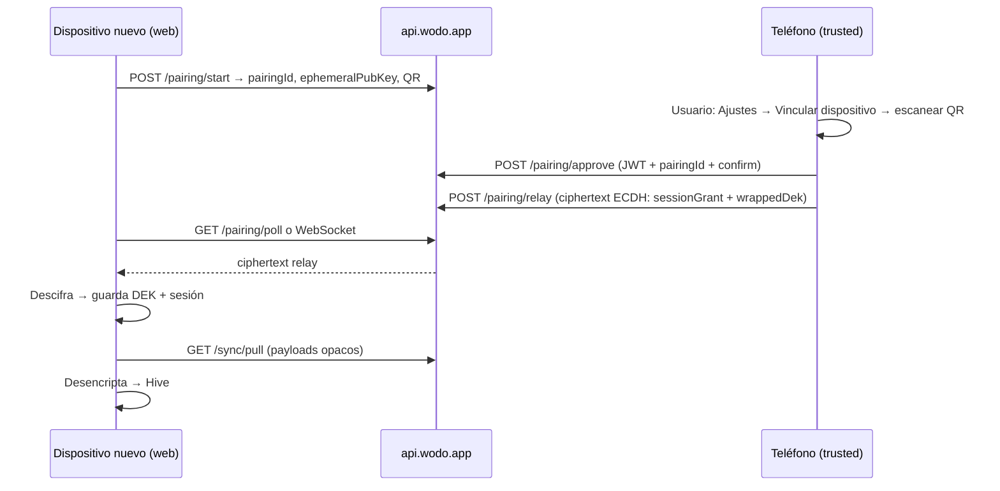
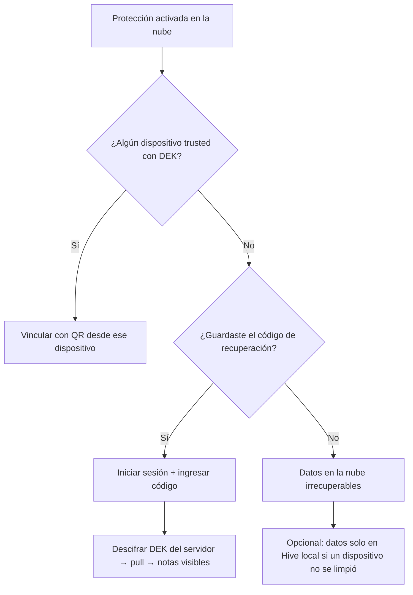

# TRD — Datos protegidos en la nube (E2EE + vinculación de dispositivos)

**Producto:** WODO (Todos App)  
**Referencia:** Sync auth (`deploy/AUTH_SYNC_ROLLOUT.md`), `backend/src/sync`, `lib/features/sync`  
**Fecha:** 31 Jul 2026  
**Estado:** Draft — diseño para implementación por fases

---

## 1. Objetivo

Ofrecer **sincronización multi-dispositivo** donde el contenido sensible (título, descripción, etiquetas de notas/tareas) esté **encriptado de extremo a extremo (E2EE)** en el servidor: solo el usuario, en dispositivos **vinculados**, puede leerlo.

La **autenticación** (email + contraseña, JWT) queda separada de la **protección de datos** (DEK + vinculación tipo WhatsApp). Cambiar contraseña no reencripta notas. Nuevo dispositivo obtiene sesión + datos con **un QR**, sin memorizar claves.

---

## 2. Problema actual

| Capa | Hoy |
|------|-----|
| Transporte | HTTPS (TLS) |
| Auth | JWT + bcrypt |
| Contenido en servidor | **Texto plano** en `sync_mutations.payload`, `notes.content`, `tags.name`, etc. |
| Hive local | Sin encriptación de box |
| Multi-dispositivo | Pull/push de mutaciones con payload legible |

Un mensaje de “seguridad entre plataformas” no es creíble sin E2EE o sin dejar claro que el servidor puede leer el contenido.

---

## 3. Alcance

### Incluido (v1)

- Activación **opt-in**: “Proteger mis datos en la nube” (Ajustes).
- **DEK** aleatoria por cuenta; servidor solo almacena blobs opacos.
- **Vinculación de dispositivos** (Flujo A): dispositivo nuevo muestra QR → dispositivo de confianza escanea y aprueba → **sesión + DEK + sync inicial** en un paso.
- **Login con email** en dispositivo nuevo sin QR → sesión OK + pantalla **“Vincula tu dispositivo para ver tus datos”** (no sync silencioso vacío).
- **Código de recuperación** (una exhibición al activar protección; regenerable desde dispositivo vinculado).
- **Revocar dispositivos** desde Ajustes (lista de dispositivos vinculados).
- Encriptar en push / desencriptar en pull: `note`, `tag` (nombres); `dayEntry` según decisión de metadata (v1: outcome en blob encriptado o metadata mínima en claro — ver §4).
- Estados de UI claros: sesión vs vault desbloqueado.

### Incluido (v2 — posterior)

- Adjuntos encriptados + sync de blobs.
- Hive local encriptado (candado de app).
- PIN / biometría **local** (abrir app en el dispositivo, no clave de la nube).
- Purga / opacificación de `sync_mutations` históricas en plaintext (migración cuentas legacy).

### Fuera de alcance (v1)

- E2EE obligatorio para todas las cuentas (siempre opt-in).
- Recuperación vía soporte humano que lea notas.
- Búsqueda full-text en servidor sobre contenido encriptado.
- Emparejamiento sin al menos un dispositivo ya vinculado (excepto recovery code).

---

## 4. Decisiones de producto / ingeniería

| Tema | Decisión | Motivo |
|------|----------|--------|
| ¿Clave derivada de contraseña? | **No** para DEK | Contraseña puede cambiar; UX peor |
| ¿PIN como clave de la nube? | **No** | Entropía baja; PIN solo para candado **local** (v2) |
| ¿Cómo llega la DEK a otro dispositivo? | **Vinculación QR** (Flujo A) | Poco esfuerzo; mismo patrón que WhatsApp Web |
| ¿QR crea cuenta? | **No** | Sin cuenta → registro/login normal; QR solo **vincula** |
| ¿Login = datos en la nube? | **No** si `encryptionEnabled` | Evita “inicié sesión y no sincroniza” |
| ¿Primer dispositivo? | Registro o login + activar protección | No hay QR sin dispositivo de confianza |
| ¿Recovery? | Código de recuperación al activar; regenerar desde trusted | Si pierde todos los dispositivos vinculados |
| Algoritmo | AES-256-GCM; DEK 256 bit; ECDH P-256 para pairing | Estándar, soporte Flutter/web |
| Metadata en servidor | v1: `entityType`, `entityId`, `operation`, revision, timestamps; **payload opaco** | Sync y conflictos; minimizar leakage |
| Cuentas sin protección | Sync plaintext como hoy | No romper usuarios existentes |
| Copy web entrada | **Crear cuenta** / **Iniciar sesión** / **Entrar con tu teléfono (QR)** — no “primera vez” en login | Quien inicia sesión ya tiene cuenta |

---

## 5. Modelos de estado

### 5.1 Cuenta (`User`)

| Campo (nuevo) | Tipo | Descripción |
|---------------|------|-------------|
| `encryptionEnabled` | bool | Usuario activó protección en la nube |
| `encryptionVersion` | int | Versión de esquema cripto (migraciones) |
| `encryptedDek` | bytes/text | DEK envuelta (ver §6.2) |
| `dekSalt` | bytes | Salt KDF si se usa recovery wrapping |
| `recoveryHint` | string? | Opcional, no secreto |

### 5.2 Dispositivo (`Device` — extender)

| Campo (nuevo) | Tipo | Descripción |
|---------------|------|-------------|
| `trusted` | bool | Tiene DEK válida para esta instalación |
| `vaultState` | enum | `none` \| `trusted` \| `revoked` |
| `pairedAt` | timestamp | Última vinculación exitosa |
| `deviceEncryptionKeyId` | string? | Id de clave de dispositivo si se usa wrap por device |

### 5.3 Estado en cliente (UI)

```dart
enum CloudVaultState {
  /// Sin protección en la nube (sync plaintext o solo local).
  encryptionOff,

  /// JWT válido pero este dispositivo no tiene DEK.
  authOnly,

  /// JWT + DEK; sync encriptado operativo.
  vaultReady,

  /// Dispositivo revocado desde otro; debe volver a vincular.
  revoked,
}
```

**Reglas de UI:**

| `encryptionEnabled` | `CloudVaultState` | Perfil / banner |
|---------------------|-------------------|-----------------|
| false | cualquiera | Sync normal; sin QR |
| true | `authOnly` | “Sesión iniciada · **Vincula tu teléfono para ver tus datos**” + CTA QR |
| true | `vaultReady` | “Datos protegidos · al día” (o error sync explícito) |
| true | `revoked` | “Este dispositivo fue desvinculado” + QR |

Nunca mostrar “Datos al día” ni lista vacía sin explicación cuando `authOnly`.

---

## 6. Criptografía

### 6.1 Claves

| Clave | Origen | Uso |
|-------|--------|-----|
| **DEK** | `Random.secure()` 32 bytes, una por cuenta al activar protección | AES-GCM de payloads de entidades |
| **Pairing key pair** | Ephemeral ECDH P-256 por intento de vinculación | Intercambio seguro DEK + token de sesión |
| **Recovery key** | 128 bits aleatorios → codificado (12–16 palabras o bloque alfanumérico) | Envuelve copia de DEK en servidor; solo si no hay trusted device |

La **contraseña de cuenta** solo autentica (JWT). No envuelve la DEK.

### 6.2 Blob en servidor (`encryptedDek`)

Al activar protección en el **primer dispositivo trusted**:

1. Generar DEK.
2. Generar recovery key; mostrar **una vez** al usuario.
3. Almacenar en servidor:
   - `encryptedDekRecovery` = AES-GCM(DEK, key = KDF(recoveryKey))
   - Tras vinculación, cada trusted device puede tener `encryptedDekDevice` opcional (DEK envuelta con clave de pairing de ese dispositivo) en almacenamiento local seguro.

En **pairing**, el dispositivo trusted envía la DEK al nuevo a través del canal ECDH (el servidor solo reenvía ciphertext).

### 6.3 Payload de sync (cliente → servidor)

Estructura opaca en `sync_mutations.payload` y entidades normalizadas:

```json
{
  "v": 1,
  "alg": "AES-256-GCM",
  "nonce": "<base64>",
  "ciphertext": "<base64>",
  "aad": "<entityType:entityId optional>"
}
```

El cliente **desencripta** tras pull antes de escribir en Hive. El servidor **no** parsea `title` / `body` / `name`.

### 6.4 Cambio de contraseña

Solo actualiza credenciales y sesiones JWT. **No** toca DEK ni notas. Mensaje en UI: “Contraseña actualizada. Tus datos protegidos no cambian.”

---

## 7. Flujos de usuario

### 7.1 Entrada web (copy corregido)

```
┌────────────────────────────────────────────┐
│  WODO                                      │
│                                            │
│  [ Crear cuenta ]                          │
│                                            │
│  [ Iniciar sesión ]                        │
│                                            │
│  ─── ¿Ya usas WODO en otro dispositivo? ─── │
│                                            │
│     [ QR ]  Entrar con tu teléfono         │
│     Escanea para iniciar sesión y traer    │
│     tus datos protegidos                   │
└────────────────────────────────────────────┘
```

- **Crear cuenta** → registro email/contraseña (sin QR).
- **Iniciar sesión** → cuenta existente en **este** dispositivo; si `encryptionEnabled` y sin DEK → pantalla vinculación (§7.4).
- **Entrar con tu teléfono** → Flujo A (§7.3); requiere app con sesión activa en teléfono.

### 7.2 Activar protección (primer trusted device)

Dispositivo ya con cuenta (cualquier plataforma):

1. Ajustes → Sincronización → **“Proteger mis datos en la nube”**.
2. Sheet de confirmación: qué implica (otros dispositivos vincularán por QR; guardar código de recuperación).
3. Background: encriptar snapshot local → push blobs; banner “Protegiendo tus datos…”.
4. Pantalla **código de recuperación** (obligatorio acknowledgment).
5. `encryptionEnabled = true`; dispositivo → `vaultReady` + `trusted`.

Si el usuario **nunca** activa protección, sync sigue como hoy (plaintext en servidor).

### 7.3 Flujo A — Vincular dispositivo nuevo (QR)

**Precondición:** cuenta con `encryptionEnabled`; **al menos un** dispositivo `trusted` (o recovery key para caso sin trusted).



**Un solo paso para el usuario en web:** escaneó en el teléfono → ya está dentro con datos.

**Pairing QR payload (JSON en QR, TTL 3 min):**

```json
{
  "pairingId": "uuid",
  "apiBase": "https://api.wodo.app/api/v1",
  "ephemeralPub": "base64",
  "expiresAt": "ISO8601"
}
```

### 7.4 Login email sin QR (cuenta con protección activa)

1. Usuario elige **Iniciar sesión** (ya tiene cuenta).
2. Auth OK → JWT.
3. Cliente detecta `encryptionEnabled && !localDek`.
4. **Pantalla completa** (no Home vacío):

   - Título: **“Vincula este dispositivo”**
   - Texto: “Tu sesión está activa. Para ver tus notas y tareas protegidas, escanea el código con WODO en tu teléfono.”
   - QR (mismo flujo §7.3) + “Usar código de recuperación”.

5. Lista local: solo datos **de este dispositivo** (Hive previo), con aviso de que la nube está pendiente.

### 7.5 Sin cuenta + intento QR

Teléfono escanea sin sesión:

- App muestra: **“Crea una cuenta o inicia sesión en la app para vincular este dispositivo.”**
- CTAs: Crear cuenta / Iniciar sesión (en la app).
- Tras tener cuenta: activar protección (si quiere E2EE) o vincular si ya estaba activada en otro sitio.

### 7.6 Sin cuenta — registro (cualquier dispositivo)

1. **Crear cuenta**.
2. Uso local inmediato.
3. Opcional en onboarding: “¿Proteger datos en la nube?” → §7.2 o “Más tarde”.
4. Otros dispositivos futuros → §7.3.

### 7.7 Revocar dispositivo

Trusted device → Ajustes → Dispositivos vinculados → Revocar “Web · Chrome”.

- Servidor marca `vaultState = revoked` para ese `appUserId`.
- Ese cliente, al siguiente sync o heartbeat, pasa a `revoked` y muestra vinculación.
- DEK en servidor no se borra; solo se niega entrega a dispositivos revocados.

### 7.8 Recovery (sin trusted device)

Usuario perdió todos los dispositivos vinculados:

1. Web → Iniciar sesión → pantalla vinculación.
2. **“Usar código de recuperación”** → ingresa código.
3. Cliente descifra `encryptedDekRecovery` → obtiene DEK → `vaultReady`.
4. Opcional: regenerar recovery code y mostrar nuevo.

Sin código: **datos en la nube irrecuperables** (mensaje explícito, modelo E2EE).

---

## 8. API (backend NestJS)

Base: `/api/v1` (auth JWT salvo `pairing/start` que puede ser anónimo con rate limit).

| Método | Ruta | Auth | Descripción |
|--------|------|------|-------------|
| GET | `/users/me/security` | JWT | `encryptionEnabled`, `deviceVaultState`, lista dispositivos |
| POST | `/encryption/enable` | JWT | Genera DEK server-side storage of wrapped blobs; marca cuenta |
| POST | `/encryption/recovery/regenerate` | JWT + trusted | Nuevo recovery wrap (fase posterior) |
| POST | `/encryption/recovery/unlock` | JWT | Body: recovery code → devuelve wrapped DEK (rate limited) |
| POST | `/pairing/start` | opcional | Crea `pairingId`, TTL, devuelve datos para QR |
| POST | `/pairing/approve` | JWT trusted | Usuario confirma pairing en teléfono |
| POST | `/pairing/relay` | JWT trusted | Envía ciphertext al pairing channel |
| GET | `/pairing/poll` | pairing token | Dispositivo nuevo recibe mensajes relay |
| DELETE | `/devices/:appUserId` | JWT trusted | Revoca dispositivo |

**Sync existente** (`/sync/push`, `/sync/pull`): sin cambio de rutas; payloads opacos cuando `encryptionEnabled`. Validar que servidor no exige campos plaintext en `applyMutation` para cuentas E2EE (o desactivar projection a `notes.content` legible).

---

## 9. Cliente Flutter

### 9.1 Módulos nuevos

| Área | Archivos propuestos |
|------|---------------------|
| Vault | `lib/features/encryption/data/vault_service.dart` |
| Crypto | `lib/features/encryption/data/crypto_service.dart` (AES-GCM, ECDH) |
| Pairing UI | `lib/features/encryption/presentation/link_device_screen.dart` |
| Pairing API | `lib/features/encryption/data/pairing_service.dart` |
| Recovery | `lib/features/encryption/presentation/recovery_code_screen.dart` |
| Estados | `lib/features/encryption/domain/cloud_vault_state.dart` |

### 9.2 Integración sync

- `SyncService._push` / `_pull`: si `vaultReady`, encrypt antes de push, decrypt después de pull.
- Si `authOnly`, **no** push/pull de entidades encriptadas (solo registro de dispositivo).
- `SessionExpiryListener` y Perfil: leer `CloudVaultState`.

### 9.3 Web

- Pantalla login con tres CTAs (§7.1).
- `LinkDeviceScreen` full-screen tras login `authOnly`.
- QR generado en web; polling `/pairing/poll`.
- DEK en `sessionStorage` encriptada o memoria hasta cerrar pestaña (definir en implementación).

### 9.4 Ajustes

- Toggle “Proteger mis datos en la nube”.
- Sección “Dispositivos vinculados”.
- “Mostrar código de recuperación” / “Regenerar código” (trusted only).

---

## 10. Migración y compatibilidad

| Escenario | Comportamiento |
|-----------|----------------|
| Cuenta existente sin protección | Sin cambios; sync plaintext |
| Usuario activa protección | Migración one-way: re-push encriptado; mutaciones viejas plaintext quedan obsoletas o se purgan con política |
| Cliente viejo + cuenta E2EE | Forzar upgrade; cliente viejo no puede leer |
| `notes.content` en DB | v1 E2EE: dejar vacío o blob; fuente de verdad = mutaciones opacas |

---

## 11. Seguridad operativa (paralelo)

No sustituye E2EE pero complementa:

- Hash de `refresh_token` en `sessions` (no plaintext).
- Rate limit en pairing y recovery unlock.
- TTL corto pairing; un solo uso.
- Auditoría: `pairing_events` (quién aprobó, cuándo, IP).
- Documento `SECURITY.md` con modelo de amenazas.

---

## 12. Fases de implementación

| Fase | Entregable |
|------|------------|
| **P0 — Diseño** | Este TRD + `SECURITY.md` resumen |
| **P1 — Pairing sin E2EE** | QR vinculación + estados UI + revocar; sync plaintext (validar flujo) |
| **P2 — E2EE enable** | Activar protección + **recovery obligatorio** (pantalla + copiar + `.txt`) + encrypt push/pull |
| **P3 — Hardening** | Purga plaintext legacy, refresh token hash, adjuntos |
| **P4 — Correo transaccional** | Resend unificado: `welcome`, `password_reset`, opcional `vault_recovery` (reenvío de código sin persistir en servidor) |

---

## 13. Criterios de aceptación (v1 E2EE + pairing)

1. Usuario **sin cuenta** puede **Crear cuenta** sin QR; protección es opt-in posterior.
2. Usuario con cuenta y protección activa puede **Entrar con teléfono (QR)** en web → sesión + datos sin segundo paso.
3. Usuario con cuenta elige **Iniciar sesión** sin QR → ve pantalla **Vincula este dispositivo**, no Home vacío ni “Datos al día” falso.
4. Escanear QR sin sesión en app → mensaje para crear cuenta / iniciar sesión en app.
5. Contenido en `sync_mutations` para cuentas protegidas no contiene `title`/`body` legibles (verificación manual / test).
6. Cambio de contraseña no rompe lectura de notas en dispositivos vinculados.
7. Revocar dispositivo obliga a vincular de nuevo.
8. Recovery code restaura acceso sin trusted device (incl. web tras borrar caché).
9. Cuenta sin protección: sync y UI como antes.
10. Activar protección no permite continuar sin acknowledgment del código de recuperación.

---

## 14. Decisiones de producto (cerradas)

| # | Tema | Decisión |
|---|------|----------|
| 1 | **Contenido en blob encriptado** | **Título, descripción, etiquetas** y resto del contenido de la nota/tarea van **dentro del blob** (Opción B). El servidor no lee “de qué trata” la tarea. Solo metadata de **sync**: `entityId`, `operation`, revisiones, timestamps de mutación. |
| 2 | **DEK en web** | **Opción B:** persistir DEK mientras la sesión web está activa. **Cerrar sesión** o revocar dispositivo → borrar DEK local; volver a vincular (QR) o recovery. |
| 3 | **Límite de dispositivos** | **Sin límite** fijo. Lista gestionable en Ajustes; el usuario puede **revocar** cualquier dispositivo que no reconozca. |
| 4 | **Nombres en lista** | **Automático** (plataforma / navegador) + **última sincronización** + **nombre editable** por el usuario (ej. “Mi laptop trabajo”). |

### 14.1 Privacidad vs contenido “malo” en tareas (decisión §1)

Con E2EE el servidor **no puede leer** títulos ni descripciones. Eso protege vida privada cotidiana (“ir al baño”, medicación, citas, salud) — alineado con la promesa del producto.

**Implicación:** no hay moderación automática del *texto* de notas en la nube (igual que Signal / Proton). El control es por **cuenta** (ToS, reporte de usuario, bloqueo de cuenta, rate limits), no por escaneo de contenido.

**Qué va en el blob (v1):** todo lo que el usuario escribe o etiqueta que identifique la tarea/nota. **Qué no va en claro:** nada de contenido semántico; solo lo necesario para mover blobs y ordenar sync.

---

## 15. Recuperación sin dispositivo con DEK

Escenarios: cerraste todas las pestañas, borraste caché del navegador, solo usas web (app aún no en tiendas), revocaste dispositivos, perdiste el teléfono.

### 15.1 Dos llaves distintas (recordatorio)

| Llave | Qué abre | Si solo tienes esto… |
|-------|----------|----------------------|
| **Email + contraseña** | Cuenta (JWT) | Ves que la cuenta existe, **pero no** tus notas encriptadas |
| **DEK** | Contenido en la nube | Necesitas vinculación QR **o** **código de recuperación** |
| **Código de recuperación** | Copia de la DEK en el servidor (envuelta) | Puedes recuperar datos **sin** otro dispositivo |

**Iniciar sesión ≠ tener la data** cuando `encryptionEnabled` es true.

### 15.2 Caminos para recuperar datos

**Prioridad de producto:**

| Caso | Camino |
|------|--------|
| **Peor caso** (sin otro dispositivo, caché borrada, solo PC) | **Opción B** — código de recuperación (pantalla + copiar + descarga `.txt`) |
| **Caso habitual** (otro dispositivo aún vinculado) | **Opción A** — QR desde teléfono / otro equipo |
| **Sin código ni dispositivo** | **Opción C** — límite E2EE; datos en nube irrecuperables |

La Opción A **no sustituye** a B en el peor caso; es atajo cuando ya tienes un trusted device.



| Situación | Qué hacer |
|-----------|-----------|
| Web: cerraste pestañas, **sesión expiró** | **Iniciar sesión** → si no hay DEK: **QR** (si tienes otro dispositivo) o **código de recuperación** |
| Web: **borraste caché / datos del sitio** | Igual: login + recovery o QR. La DEK local se perdió con la caché |
| **Solo PC**, app móvil aún no existe | Al **activar protección**, obligatorio guardar **código de recuperación** (no depender del teléfono). Luego: login + recovery si limpias el navegador |
| **Todos** los dispositivos revocados | Login + **código de recuperación** (único camino sin otro equipo) |
| Perdiste recovery y todos los dispositivos | **No se puede** recuperar la nube. Mensaje explícito en producto y en este TRD |

### 15.3 UX obligatoria al activar protección

1. Pantalla **“Guarda tu código de recuperación”** — confirmación explícita (“Lo guardé” / copiar).
2. Texto: *“Si pierdes todos tus dispositivos y este código, no podremos recuperar tus notas en la nube.”*
3. Descarga opcional `.txt` del código (mismo momento).
4. Ajustes: **“Ver / regenerar código”** solo desde dispositivo **trusted** (regenerar invalida el anterior).
5. Pantalla **“Vincula este dispositivo”**: **“Usar código de recuperación”** siempre visible si `encryptionEnabled`.

**Correo (fase posterior, P4):** botón opcional *“Enviar también a mi correo”* vía Resend (`vault_recovery`), junto con otros flujos transaccionales (`welcome`, `password_reset`). El servidor no almacenaría el código; solo reenviaría al email de la cuenta. No bloquea P2: la recuperación funciona sin correo.

### 15.4 Respuesta directa: “¿No se puede?”

- **Sí se puede**, si al activar protección guardaste el **código de recuperación**: entras con email/contraseña en web e ingresas el código → recuperas DEK y datos.
- **No se puede** recuperar la nube si no hay dispositivo trusted **ni** código de recuperación (límite real del E2EE; no es bug).
- Datos **solo en ese PC** en Hive pueden sobrevivir si no borraste datos del sitio; la nube sigue necesitando DEK o recovery para descargar/desencriptar de nuevo.

---

## 16. Referencias

- WhatsApp Linked Devices (QR, ephemeral keys, server relay).
- Standard Notes / Bitwarden (DEK + recovery code).
- Código actual: `lib/features/sync/data/sync_service.dart`, `backend/src/sync/sync.service.ts`, `backend/prisma/schema.prisma`.
