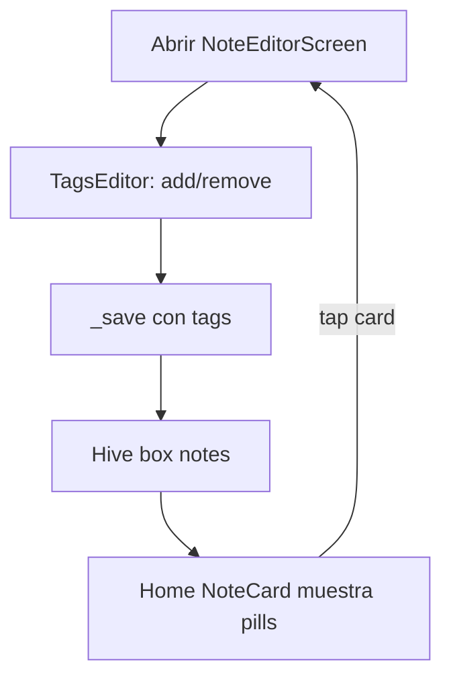

# TRD — Tags básicos

**Producto:** Todos App  
**Referencia PRD:** §6.2 (campo `tags[]`), §6.9 (P0 básico), §6.5 P1 (filtro por tag)  
**Fecha:** 16 Jul 2026  
**Estado:** Implementado (P0)

---

## 1. Objetivo

Permitir **organizar y categorizar** notas/tareas mediante etiquetas textuales libres, con colores soft consistentes, editables desde el editor y visibles en las cards de la lista.

---

## 2. Alcance

### Incluido (P0)

- Campo `List<String> tags` en `NoteItem`
- Persistencia Hive vía `toMap` / `fromMap` (retrocompatible: ausencia de key → `[]`)
- Paleta fija de 6 colores soft; color derivado por hash del nombre del tag
- Widget `TagPill` en cards (máx. 3 visibles + “+N”)
- Widget `TagsEditor` en `NoteEditorScreen` (añadir / quitar / crear al escribir)
- Autocompletado con tags ya usados (`NotesRepository.getAllTags()`)
- Normalización: trim, no vacíos, case-insensitive dedupe al añadir
- Tests de serialización, colores y repository

### Incluido (P1 — fuera de este slice)

- Filtro por tag en Home (chips dinámicos / tap en pill → filtrar)
- `NotesQuery.applyTagFilter`
- Combinar filtro de tipo + tag + búsqueda

### Fuera de alcance

- Tags jerárquicos o anidados
- Renombrar / fusionar tags globalmente
- Sync multi-dispositivo de catálogo de tags
- Analytics de uso de tags
- Tags en captura rápida (solo body; se etiquetan al abrir editor)

---

## 3. Decisiones de producto / ingeniería

| Tema | Decisión | Motivo |
|---|---|---|
| ¿Filtro por tag en este slice? | **No (P1 / v1.1)** | El PRD §6.5 marca filtro por tag como P1; P0 = asignar y ver tags |
| ¿Modelo de tag aparte? | **No** — `List<String>` en la nota | Simple, sin box Hive extra; catálogo = unión de tags en notas |
| ¿Case sensitivity? | Guardar **display** del primer uso; comparar **lowercase** al dedupe | Evita “Work” y “work” duplicados |
| ¿Límite de tags por nota? | Soft: **10** máx. en editor | Evita ruido en cards |
| ¿Máx. visibles en card? | **3** + `+N` | Compacto en móvil |

---

## 4. Modelo y lógica

### 4.1 Cambios en `NoteItem`

```dart
final List<String> tags;

// toMap
'tags': tags,

// fromMap (retrocompatible)
tags: (map['tags'] as List?)
        ?.map((e) => e.toString())
        .where((e) => e.trim().isNotEmpty)
        .toList() ??
    const [],
```

- `copyWith` debe aceptar `List<String>? tags`
- Call sites de `NoteItem(...)` (quick capture, editor, tests) pasan `tags: const []` o la lista editada

### 4.2 Normalización al añadir tag

1. `trim()`
2. Rechazar si queda vacío
3. Si ya existe (comparación `toLowerCase()`), no duplicar
4. Si supera 10, ignorar y mostrar snackbar: `Máximo 10 etiquetas`

### 4.3 `TagColors`

Archivo: `lib/features/notes/domain/tag_colors.dart`

```dart
class TagColorPair {
  const TagColorPair({required this.background, required this.foreground});
  final Color background;
  final Color foreground;
}

class TagColors {
  static TagColorPair colorForTag(String tag) { /* hash → palette[i] */ }
}
```

Paleta (índice = `tag.toLowerCase().hashCode.abs() % 6`):

| Índice | Fondo | Texto |
|---|---|---|
| 0 | `AppColors.primary00` | `AppColors.primary80` |
| 1 | `AppColors.secondary00` | `AppColors.secondary80` |
| 2 | `AppColors.tertiary15` | `AppColors.primary80` |
| 3 | `AppColors.neutral00` | `AppColors.neutral80` |
| 4 | `AppColors.primary20` | `AppColors.primary80` |
| 5 | `AppColors.secondary20` | `AppColors.secondary80` |

Mismo string → mismo color siempre (sesión / dispositivo).

### 4.4 `NotesRepository.getAllTags()`

```dart
Set<String> getAllTags() {
  final tags = <String>{};
  for (final item in getAll()) {
    tags.addAll(item.tags);
  }
  return tags;
}
```

- Usado por `TagsEditor` para sugerencias
- Orden sugerido en UI: alfabético case-insensitive

### 4.5 Query (solo P1 — especificación futura)

```dart
static List<NoteItem> applyTagFilter(
  List<NoteItem> items,
  String? tag,
) {
  if (tag == null || tag.trim().isEmpty) return items;
  final needle = tag.toLowerCase();
  return items
      .where((item) =>
          item.tags.any((t) => t.toLowerCase() == needle))
      .toList();
}
```

Combinación futura con `NotesQuery.apply`: tipo → tag → search (AND).

---

## 5. UI

### 5.1 `TagPill`

Archivo: `lib/features/notes/presentation/widgets/tag_pill.dart`

- Altura ~24, padding horizontal 8, border radius 12
- Texto `labelSmall`, color de `TagColors.colorForTag`
- Props: `label`, `onTap?`, `onDelete?` (muestra icono X si `onDelete != null`)

### 5.2 Cards (`NoteCard`)

Debajo del preview / antes de la fila meta (tipo · tiempo):

```
[Tag1] [Tag2] [Tag3] [+2]
```

- Si `tags.isEmpty` → no mostrar fila
- Tap en pill: **sin acción en P0** (en P1 → activar filtro por ese tag)

### 5.3 `TagsEditor`

Archivo: `lib/features/notes/presentation/widgets/tags_editor.dart`

```
Etiquetas
[Work ×] [Personal ×]
[ + Añadir tag… ]   ← TextField / Autocomplete
```

- Enter o submit → añade tag normalizado
- Sugerencias: tags de `getAllTags()` que no estén ya en la nota
- Integrado en `NoteEditorScreen` debajo del body; estado `_tags` se persiste en `_save`

### 5.4 Captura rápida

Sin cambio de UI: nuevas notas vía quick capture nacen con `tags: []`. El usuario añade tags al abrir el editor.

---

## 6. Flujo



---

## 7. Archivos

| Archivo | Rol |
|---|---|
| `lib/features/notes/domain/note_item.dart` | Campo `tags` + serialización |
| `lib/features/notes/domain/tag_colors.dart` | Paleta + `colorForTag` |
| `lib/features/notes/data/notes_repository.dart` | `getAllTags()` |
| `lib/features/notes/presentation/widgets/tag_pill.dart` | Pill visual |
| `lib/features/notes/presentation/widgets/tags_editor.dart` | Editor inline |
| `lib/features/notes/presentation/widgets/note_card.dart` | Mostrar hasta 3 pills |
| `lib/features/notes/presentation/note_editor_screen.dart` | Integrar TagsEditor |
| `lib/features/notes/presentation/widgets/quick_capture_field.dart` | `tags: []` al crear |
| `test/features/notes/tag_colors_test.dart` | Consistencia de colores |
| `test/features/notes/notes_repository_test.dart` | Roundtrip + getAllTags |

---

## 8. Criterios de aceptación

- [x] `NoteItem` persiste y restaura `tags` (incluye notas antiguas sin key → `[]`)
- [x] Mismo tag siempre obtiene el mismo par de colores
- [x] Editor permite añadir tag nuevo y eliminar existentes
- [x] No se duplican tags case-insensitive
- [x] Card muestra hasta 3 tags y `+N` si hay más
- [x] Autocompletado sugiere tags ya usados en otras notas
- [x] Tests unitarios pasan (`flutter test`)
- [x] Filtro por tag **no** implementado en este slice (documentado como P1)

---

## 9. Copy sugerido (ES)

| Contexto | Texto |
|---|---|
| Label sección editor | `Etiquetas` |
| Placeholder input | `Añadir tag…` |
| Overflow en card | `+N` (ej. `+2`) |
| Límite alcanzado | `Máximo 10 etiquetas` |
| Hint vacío (opcional) | `Sin etiquetas` |

---

## 10. Dependencias

- `AppColors` en [`lib/global/themes/app_colors.dart`](lib/global/themes/app_colors.dart)
- Persistencia Hive existente (`NotesRepository`)
- Búsqueda/filtros actuales **no** buscan dentro de tags en P0 (opcional: incluir `tags` en search en un follow-up menor)

---

## 11. Orden de implementación sugerido

1. Modelo `NoteItem` + actualizar call sites + tests roundtrip  
2. `TagColors` + tests  
3. `getAllTags()` + tests  
4. `TagPill` + integrar en `NoteCard`  
5. `TagsEditor` + integrar en `NoteEditorScreen`  
6. QA manual: crear tag, reabrir, ver color estable en lista  

---

**Próximo paso tras merge de este TRD:** implementar el slice P0 en el orden anterior.  
**Después:** autoguardado en editor, o filtro por tag (P1), según prioridad de producto.
